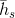

# 聊天机器人教程
在本教程中，我们探索一个好玩有趣的循环的序列到序列（sequence-to-sequence）的模型用例。我们将用[Cornell Movie-Dialogs Corpus](https://www.cs.cornell.edu/~cristian/Cornell_Movie-Dialogs_Corpus.html)
处的电影剧本来训练一个简单的聊天机器人。

在人工智能研究领域中，对话模型是一个非常热门的话题。聊天机器人可以在各种设置中找到，包括客户服务应用和在线帮助。这些机器人通常
由基于检索的模型提供支持，这些模型的输出是某些形式问题预先定义的响应。在像公司IT服务台这样高度受限制的领域中，这些模型可能足够了，
但是，对于更一般的用例它们还不够健壮。让一台机器与多领域的人进行有意义的对话是一个远未解决的研究问题。最近，深度学习热潮已经允许
强大的生成模型，如谷歌的神经对话模型[Neural Conversational Model](https://arxiv.org/abs/1506.05869)，这标志着向多领域生成对话模型迈出了一大步。
在本教程中，我们将在PyTorch中实现这种模型。


````buildoutcfg
> hello?
Bot: hello .
> where am I?
Bot: you re in a hospital .
> who are you?
Bot: i m a lawyer .
> how are you doing?
Bot: i m fine .
> are you my friend?
Bot: no .
> you're under arrest
Bot: i m trying to help you !
> i'm just kidding
Bot: i m sorry .
> where are you from?
Bot: san francisco .
> it's time for me to leave
Bot: i know .
> goodbye
Bot: goodbye .
````

#### 教程要点
* 对[Cornell Movie-Dialogs Corpus](https://www.cs.cornell.edu/~cristian/Cornell_Movie-Dialogs_Corpus.html)数据集的加载和预处理
* 用[Luong attention mechanism(s)](https://arxiv.org/abs/1508.04025)实现一个sequence-to-sequence模型
* 使用小批量数据联合训练解码器和编码器模型
* 实现贪婪搜索解码模块
* 与训练好的聊天机器人互动

#### 鸣谢
本教程借鉴以下源码：
* Yuan-Kuei Wu’s pytorch-chatbot implementation: https://github.com/ywk991112/pytorch-chatbot
* Sean Robertson’s practical-pytorch seq2seq-translation example: https://github.com/spro/practical-pytorch/tree/master/seq2seq-translation
* FloydHub’s Cornell Movie Corpus preprocessing code: https://github.com/floydhub/textutil-preprocess-cornell-movie-corpus

## 1.下载数据文件
下载数据文件点击[这里](https://www.cs.cornell.edu/~cristian/Cornell_Movie-Dialogs_Corpus.html)并将其放入到当前目录下的`data/`
文件夹下。之后我们引入一些必须的包。
```buildoutcfg
from __future__ import absolute_import
from __future__ import division
from __future__ import print_function
from __future__ import unicode_literals

import torch
from torch.jit import script, trace
import torch.nn as nn
from torch import optim
import torch.nn.functional as F
import csv
import random
import re
import os
import unicodedata
import codecs
from io import open
import itertools
import math

USE_CUDA = torch.cuda.is_available()
device = torch.device("cuda" if USE_CUDA else "cpu")
```

## 2.加载和预处理数据
下一步就是格式化处理我们的数据文件并将数据加载到我们可以使用的结构中。
[Cornell Movie-Dialogs Corpus](https://www.cs.cornell.edu/~cristian/Cornell_Movie-Dialogs_Corpus.html)是一个丰富的电影角色对话数据集：
* 10,292 对电影角色之间的220,579次对话
* 617部电影中的9,035个电影角色
* 总共304,713发言量

这个数据集庞大而多样，在语言形式、时间段、情感上等都有很大的变化。我们希望这种多样性使我们的模型能够适应多种形式的输入和查询。

首先，我们通过数据文件的某些行来查看原始数据的格式
```buildoutcfg
corpus_name = "cornell movie-dialogs corpus"
corpus = os.path.join("data", corpus_name)

def printLines(file, n=10):
    with open(file, 'rb') as datafile:
        lines = datafile.readlines()
    for line in lines[:n]:
        print(line)

printLines(os.path.join(corpus, "movie_lines.txt"))
```
* 输出结果
```buildoutcfg
b'L1045 +++$+++ u0 +++$+++ m0 +++$+++ BIANCA +++$+++ They do not!\n'
b'L1044 +++$+++ u2 +++$+++ m0 +++$+++ CAMERON +++$+++ They do to!\n'
b'L985 +++$+++ u0 +++$+++ m0 +++$+++ BIANCA +++$+++ I hope so.\n'
b'L984 +++$+++ u2 +++$+++ m0 +++$+++ CAMERON +++$+++ She okay?\n'
b"L925 +++$+++ u0 +++$+++ m0 +++$+++ BIANCA +++$+++ Let's go.\n"
b'L924 +++$+++ u2 +++$+++ m0 +++$+++ CAMERON +++$+++ Wow\n'
b"L872 +++$+++ u0 +++$+++ m0 +++$+++ BIANCA +++$+++ Okay -- you're gonna need to learn how to lie.\n"
b'L871 +++$+++ u2 +++$+++ m0 +++$+++ CAMERON +++$+++ No\n'
b'L870 +++$+++ u0 +++$+++ m0 +++$+++ BIANCA +++$+++ I\'m kidding.  You know how sometimes you just become this "persona"?  And you don\'t know how to quit?\n'
b'L869 +++$+++ u0 +++$+++ m0 +++$+++ BIANCA +++$+++ Like my fear of wearing pastels?\n'
```
#### 2.1 创建格式化数据文件
为了方便起见，我们将创建一个格式良好的数据文件，其中每一行包含一个由`tab`制表符分隔的查询语句和响应语句对。

以下函数便于解析原始 movie_lines.txt 数据文件。
* `loadLines`:将文件的每一行拆分为字段`(lineID, characterID, movieID, character, text)`组合的字典
* `loadConversations` :根据`movie_conversations.txt`将`loadLines`中的每一行数据进行归类
* `extractSentencePairs`: 从对话中提取句子对
```buildoutcfg
# 将文件的每一行拆分为字段字典
def loadLines(fileName, fields):
    lines = {}
    with open(fileName, 'r', encoding='iso-8859-1') as f:
        for line in f:
            values = line.split(" +++$+++ ")
            # Extract fields
            lineObj = {}
            for i, field in enumerate(fields):
                lineObj[field] = values[i]
            lines[lineObj['lineID']] = lineObj
    return lines

# 将 `loadLines` 中的行字段分组为基于 *movie_conversations.txt* 的对话
def loadConversations(fileName, lines, fields):
    conversations = []
    with open(fileName, 'r', encoding='iso-8859-1') as f:
        for line in f:
            values = line.split(" +++$+++ ")
            # Extract fields
            convObj = {}
            for i, field in enumerate(fields):
                convObj[field] = values[i]
            # Convert string to list (convObj["utteranceIDs"] == "['L598485', 'L598486', ...]")
            lineIds = eval(convObj["utteranceIDs"])
            # Reassemble lines
            convObj["lines"] = []
            for lineId in lineIds:
                convObj["lines"].append(lines[lineId])
            conversations.append(convObj)
    return conversations

# 从对话中提取一对句子
def extractSentencePairs(conversations):
    qa_pairs = []
    for conversation in conversations:
        # Iterate over all the lines of the conversation
        for i in range(len(conversation["lines"]) - 1):  # We ignore the last line (no answer for it)
            inputLine = conversation["lines"][i]["text"].strip()
            targetLine = conversation["lines"][i+1]["text"].strip()
            # Filter wrong samples (if one of the lists is empty)
            if inputLine and targetLine:
                qa_pairs.append([inputLine, targetLine])
    return qa_pairs
```
现在我们将调用这些函数来创建文件，我们命名为`formatted_movie_lines.txt`。
```buildoutcfg
# 定义新文件的路径
datafile = os.path.join(corpus, "formatted_movie_lines.txt")

delimiter = '\t'

delimiter = str(codecs.decode(delimiter, "unicode_escape"))

# 初始化行dict，对话列表和字段ID
lines = {}
conversations = []
MOVIE_LINES_FIELDS = ["lineID", "characterID", "movieID", "character", "text"]
MOVIE_CONVERSATIONS_FIELDS = ["character1ID", "character2ID", "movieID", "utteranceIDs"]

# 加载行和进程对话
print("\nProcessing corpus...")
lines = loadLines(os.path.join(corpus, "movie_lines.txt"), MOVIE_LINES_FIELDS)
print("\nLoading conversations...")
conversations = loadConversations(os.path.join(corpus, "movie_conversations.txt"),
                                  lines, MOVIE_CONVERSATIONS_FIELDS)

# 写入新的csv文件
print("\nWriting newly formatted file...")
with open(datafile, 'w', encoding='utf-8') as outputfile:
    writer = csv.writer(outputfile, delimiter=delimiter, lineterminator='\n')
    for pair in extractSentencePairs(conversations):
        writer.writerow(pair)

# 打印一个样本的行
print("\nSample lines from file:")
printLines(datafile)
```
* 输出结果：
```buildoutcfg
Processing corpus...

Loading conversations...

Writing newly formatted file...

Sample lines from file:
b"Can we make this quick?  Roxanne Korrine and Andrew Barrett are having an incredibly horrendous public break- up on the quad.  Again.\tWell, I thought we'd start with pronunciation, if that's okay with you.\n"
b"Well, I thought we'd start with pronunciation, if that's okay with you.\tNot the hacking and gagging and spitting part.  Please.\n"
b"Not the hacking and gagging and spitting part.  Please.\tOkay... then how 'bout we try out some French cuisine.  Saturday?  Night?\n"
b"You're asking me out.  That's so cute. What's your name again?\tForget it.\n"
b"No, no, it's my fault -- we didn't have a proper introduction ---\tCameron.\n"
b"Cameron.\tThe thing is, Cameron -- I'm at the mercy of a particularly hideous breed of loser.  My sister.  I can't date until she does.\n"
b"The thing is, Cameron -- I'm at the mercy of a particularly hideous breed of loser.  My sister.  I can't date until she does.\tSeems like she could get a date easy enough...\n"
b'Why?\tUnsolved mystery.  She used to be really popular when she started high school, then it was just like she got sick of it or something.\n'
b"Unsolved mystery.  She used to be really popular when she started high school, then it was just like she got sick of it or something.\tThat's a shame.\n"
b'Gosh, if only we could find Kat a boyfriend...\tLet me see what I can do.\n'
```

#### 2.2 加载和清洗数据
我们下一个任务是创建词汇表并将查询/响应句子对（对话）加载到内存。

注意我们正在处理**词序**，这些词序没有映射到离散数值空间。因此，我们必须通过数据集中的单词来创建一个索引。

为此我们创建了一个`Voc`类,它会存储从单词到索引的映射、索引到单词的反向映射、每个单词的计数和总单词量。这个类提供向词汇表中添
加单词的方法(`addWord`)、添加所有单词到句子中的方法 (`addSentence`) 和清洗不常见的单词方法(`trim`)。更多的数据清洗在后面进行。
```buildoutcfg
# 默认词向量
PAD_token = 0  # Used for padding short sentences
SOS_token = 1  # Start-of-sentence token
EOS_token = 2  # End-of-sentence token

class Voc:
    def __init__(self, name):
        self.name = name
        self.trimmed = False
        self.word2index = {}
        self.word2count = {}
        self.index2word = {PAD_token: "PAD", SOS_token: "SOS", EOS_token: "EOS"}
        self.num_words = 3  # Count SOS, EOS, PAD

    def addSentence(self, sentence):
        for word in sentence.split(' '):
            self.addWord(word)

    def addWord(self, word):
        if word not in self.word2index:
            self.word2index[word] = self.num_words
            self.word2count[word] = 1
            self.index2word[self.num_words] = word
            self.num_words += 1
        else:
            self.word2count[word] += 1

    # 删除低于特定计数阈值的单词
    def trim(self, min_count):
        if self.trimmed:
            return
        self.trimmed = True

        keep_words = []

        for k, v in self.word2count.items():
            if v >= min_count:
                keep_words.append(k)

        print('keep_words {} / {} = {:.4f}'.format(
            len(keep_words), len(self.word2index), len(keep_words) / len(self.word2index)
        ))

        # 重初始化字典
        self.word2index = {}
        self.word2count = {}
        self.index2word = {PAD_token: "PAD", SOS_token: "SOS", EOS_token: "EOS"}
        self.num_words = 3 # Count default tokens

        for word in keep_words:
            self.addWord(word)
```
现在我们可以组装词汇表和查询/响应语句对。在使用数据之前，我们必须做一些预处理。

首先，我们必须使用`unicodeToAscii`将 unicode 字符串转换为 ASCII。然后，我们应该将所有字母转换为小写字母并清洗掉除基本标点之
外的所有非字母字符 (`normalizeString`)。最后，为了帮助训练收敛，我们将过滤掉长度大于MAX_LENGTH 的句子 (`filterPairs`)。
```buildoutcfg
MAX_LENGTH = 10  # Maximum sentence length to consider

# 将Unicode字符串转换为纯ASCII，多亏了
# https://stackoverflow.com/a/518232/2809427
def unicodeToAscii(s):
    return ''.join(
        c for c in unicodedata.normalize('NFD', s)
        if unicodedata.category(c) != 'Mn'
    )

# 初始化Voc对象 和 格式化pairs对话存放到list中
def readVocs(datafile, corpus_name):
    print("Reading lines...")
    # Read the file and split into lines
    lines = open(datafile, encoding='utf-8').read().strip().split('\n')
    # Split every line into pairs and normalize
    pairs = [[normalizeString(s) for s in l.split('\t')] for l in lines]
    voc = Voc(corpus_name)
    return voc, pairs

# 如果对 'p' 中的两个句子都低于 MAX_LENGTH 阈值，则返回True
def filterPair(p):
    # Input sequences need to preserve the last word for EOS token
    return len(p[0].split(' ')) < MAX_LENGTH and len(p[1].split(' ')) < MAX_LENGTH

# 过滤满足条件的 pairs 对话
def filterPairs(pairs):
    return [pair for pair in pairs if filterPair(pair)]

# 使用上面定义的函数，返回一个填充的voc对象和对列表
def loadPrepareData(corpus, corpus_name, datafile, save_dir):
    print("Start preparing training data ...")
    voc, pairs = readVocs(datafile, corpus_name)
    print("Read {!s} sentence pairs".format(len(pairs)))
    pairs = filterPairs(pairs)
    print("Trimmed to {!s} sentence pairs".format(len(pairs)))
    print("Counting words...")
    for pair in pairs:
        voc.addSentence(pair[0])
        voc.addSentence(pair[1])
    print("Counted words:", voc.num_words)
    return voc, pairs

# 加载/组装voc和对
save_dir = os.path.join("data", "save")
voc, pairs = loadPrepareData(corpus, corpus_name, datafile, save_dir)
# 打印一些对进行验证
print("\npairs:")
for pair in pairs[:10]:
    print(pair)
```
* 输出结果：
```buildoutcfg
Start preparing training data ...
Reading lines...
Read 221282 sentence pairs
Trimmed to 64271 sentence pairs
Counting words...
Counted words: 18008

pairs:
['there .', 'where ?']
['you have my word . as a gentleman', 'you re sweet .']
['hi .', 'looks like things worked out tonight huh ?']
['you know chastity ?', 'i believe we share an art instructor']
['have fun tonight ?', 'tons']
['well no . . .', 'then that s all you had to say .']
['then that s all you had to say .', 'but']
['but', 'you always been this selfish ?']
['do you listen to this crap ?', 'what crap ?']
['what good stuff ?', 'the real you .']
```

另一种有利于让训练更快收敛的策略是去除词汇表中很少使用的单词。减少特征空间也会降低模型学习目标函数的难度。我们通过以下两个步
骤完成这个操作:
* 使用`voc.trim`函数去除 MIN_COUNT 阈值以下单词 。
* 如果句子中包含词频过小的单词，那么整个句子也被过滤掉。
```buildoutcfg
MIN_COUNT = 3    # 修剪的最小字数阈值

def trimRareWords(voc, pairs, MIN_COUNT):
    # 修剪来自voc的MIN_COUNT下使用的单词
    voc.trim(MIN_COUNT)
    # Filter out pairs with trimmed words
    keep_pairs = []
    for pair in pairs:
        input_sentence = pair[0]
        output_sentence = pair[1]
        keep_input = True
        keep_output = True
        # 检查输入句子
        for word in input_sentence.split(' '):
            if word not in voc.word2index:
                keep_input = False
                break
        # 检查输出句子
        for word in output_sentence.split(' '):
            if word not in voc.word2index:
                keep_output = False
                break

        # 只保留输入或输出句子中不包含修剪单词的对
        if keep_input and keep_output:
            keep_pairs.append(pair)

    print("Trimmed from {} pairs to {}, {:.4f} of total".format(len(pairs), len(keep_pairs), len(keep_pairs) / len(pairs)))
    return keep_pairs


# 修剪voc和对
pairs = trimRareWords(voc, pairs, MIN_COUNT)
```
* 输出结果：
```buildoutcfg
keep_words 7823 / 18005 = 0.4345
Trimmed from 64271 pairs to 53165, 0.8272 of total
```

## 3.为模型准备数据
尽管我们已经投入了大量精力来准备和清洗我们的数据，将它变成一个很好的词汇对象和一系列的句子对，但我们的模型最终希望数据以
`numerical torch`张量作为输入。可以在[seq2seq translation tutorial](https://pytorch.org/tutorials/intermediate/seq2seq_translation_tutorial.html)
中找到为模型准备处理数据的一种方法。 在该教程中，我们使用`batch size`大小为1，这意味着我们所要做的就是将句子对中的单词转换为词汇表中的相应索引，并将其提供给模型。

但是，如果你想要加速训练或者想要利用GPU并行计算能力，则需要使用小批量`mini-batches`来训练。

使用小批量`mini-batches`也意味着我们必须注意批量处理中句子长度的变化。为了容纳同一batch中不同大小的句子，我们将使我们的批量输
入张量大小`(max_length，batch_size)`，其中短于*max_length*的句子在*EOS_token*之后进行零填充（`zero padded`）。

如果我们简单地将我们的英文句子转换为张量，通过将单词转换为索引`indicesFromSentence`和零填充`zero-pad`，我们的张量的大小将是
`(batch_size，max_length)`，并且索引第一维将在所有时间步骤中返回完整序列。但是，我们需要沿着时间对我们批量数据进行索引并且包
括批量数据中所有序列。因此，我们将输入批处理大小转换为`(max_length，batch_size)`，以便跨第一维的索引返回批处理中所有句子的时
间步长。 我们在`zeroPadding`函数中隐式处理这个转置。


`inputvar`函数是处理将句子转换为张量的过程，最终创建正确大小的零填充张量。它还返回批处理中每个序列的长度张量(tensor of lengths)，
长度张量稍后将传递给我们的解码器。

`outputvar`函数执行与`inputvar`类似的函数，但他不返回长度张量，而是返回二进制 mask tensor 和最大目标句子长度。二进制 mask 
tensor 的大小与输出目标张量的大小相同，但作为`PAD_token`的每个元素都是0而其他元素都是1。

`batch2traindata`只需要取一批句子对，并使用上述函数返回输入张量和目标张量。

```buildoutcfg
def indexesFromSentence(voc, sentence):
    return [voc.word2index[word] for word in sentence.split(' ')] + [EOS_token]

# zip 对数据进行合并了，相当于行列转置了
def zeroPadding(l, fillvalue=PAD_token):
    return list(itertools.zip_longest(*l, fillvalue=fillvalue))

# 记录 PAD_token的位置为0， 其他的为1
def binaryMatrix(l, value=PAD_token):
    m = []
    for i, seq in enumerate(l):
        m.append([])
        for token in seq:
            if token == PAD_token:
                m[i].append(0)
            else:
                m[i].append(1)
    return m

# 返回填充前（加入结束index EOS_token做标记）的长度 和 填充后的输入序列张量
def inputVar(l, voc):
    indexes_batch = [indexesFromSentence(voc, sentence) for sentence in l]
    lengths = torch.tensor([len(indexes) for indexes in indexes_batch])
    padList = zeroPadding(indexes_batch)
    padVar = torch.LongTensor(padList)
    return padVar, lengths

# 返回填充前（加入结束index EOS_token做标记）最长的一个长度 和 填充后的输入序列张量, 和 填充后的标记 mask
def outputVar(l, voc):
    indexes_batch = [indexesFromSentence(voc, sentence) for sentence in l]
    max_target_len = max([len(indexes) for indexes in indexes_batch])
    padList = zeroPadding(indexes_batch)
    mask = binaryMatrix(padList)
    mask = torch.ByteTensor(mask)
    padVar = torch.LongTensor(padList)
    return padVar, mask, max_target_len

# 返回给定batch对的所有项目
def batch2TrainData(voc, pair_batch):
    pair_batch.sort(key=lambda x: len(x[0].split(" ")), reverse=True)
    input_batch, output_batch = [], []
    for pair in pair_batch:
        input_batch.append(pair[0])
        output_batch.append(pair[1])
    inp, lengths = inputVar(input_batch, voc)
    output, mask, max_target_len = outputVar(output_batch, voc)
    return inp, lengths, output, mask, max_target_len

# 验证例子
small_batch_size = 5
batches = batch2TrainData(voc, [random.choice(pairs) for _ in range(small_batch_size)])
input_variable, lengths, target_variable, mask, max_target_len = batches

print("input_variable:", input_variable)
print("lengths:", lengths)
print("target_variable:", target_variable)
print("mask:", mask)
print("max_target_len:", max_target_len)
```
* 输出结果：
```buildoutcfg
input_variable: tensor([[ 273,   64,   53,   25,   25],
        [ 188,  542, 4095,  200,  200],
        [  53,    4,  115,   67, 3644],
        [ 660,    4, 3600, 1531,    2],
        [1258,    4,    4,    4,    0],
        [   4,    2,    2,    2,    0],
        [   2,    0,    0,    0,    0]])
lengths: tensor([7, 6, 6, 6, 4])
target_variable: tensor([[ 147,  214,  219,  252,  122],
        [  47,    4,  389,  387,   27],
        [   7,    4,   25,   25,   14],
        [1026,    4,  222,    4,   53],
        [1034,    2,   53,    2,    4],
        [  12,    0, 4096,    0,    4],
        [1113,    0,    6,    0,    4],
        [   4,    0,    2,    0,    2],
        [   2,    0,    0,    0,    0]])
mask: tensor([[1, 1, 1, 1, 1],
        [1, 1, 1, 1, 1],
        [1, 1, 1, 1, 1],
        [1, 1, 1, 1, 1],
        [1, 1, 1, 1, 1],
        [1, 0, 1, 0, 1],
        [1, 0, 1, 0, 1],
        [1, 0, 1, 0, 1],
        [1, 0, 0, 0, 0]], dtype=torch.uint8)
max_target_len: 9
```

## 4.定义模型
#### 4.1 Seq2Seq模型
Seq2Seq模型
我们聊天机器人的大脑是序列到序列（seq2seq）模型。seq2seq模型的目标是将可变长度序列作为输入，并使用固定大小的模型将可变长度序
列作为输出返回。

[Sutskever et al.](https://arxiv.org/abs/1409.3215)发现通过一起使用两个独立的RNN，我们可以完成这项任务。第一个RNN充当**编码
器**，其将可变长度输入序列编码为固定长度上下文向量。理论上，该上下文向量（RNN的最终隐藏层）将包含关于输入到机器人的查询语句的
语义信息。第二个RNN是一个**解码器**，它接收输入文字和上下文矢量，并返回序列中下一句文字的概率和在下一次迭代中使用的隐藏状态。


图片来源: https://jeddy92.github.io/JEddy92.github.io/ts_seq2seq_intro/

#### 4.2 编码器
编码器RNN每次迭代中输入一个语句输出一个token（例如，一个单词），同时在这时间内输出“输出”向量和“隐藏状态”向量。然后将隐藏
状态向量传递到下一步，并记录输出向量。编码器将其在序列中的每一点处看到的上下文转换为高维空间中的一系列点，解码器将使用这些点
为给定任务生成有意义的输出。

我们的编码器的核心是由[Cho et al.](https://arxiv.org/pdf/1406.1078v3.pdf)等人发明的多层门循环单元。在2014年，我们将使用
GRU的双向变体，这意味着基本上有两个独立的RNN：一个以正常的顺序输入输入序列，另一个以相反的顺序输入输入序列。每个网络的输出在
每个时间步骤求和。使用双向GRU将为我们提供编码过去和未来上下文的优势。

双向RNN：


图片来源: https://colah.github.io/posts/2015-09-NN-Types-FP/

> 注意:`embedding`层用于在任意大小的特征空间中对我们的单词索引进行编码。对于我们的模型，此图层会将每个单词映射到大小为
`hidden_size`的特征空间。训练后，这些值会被编码成和他们相似的有意义词语。

最后，如果将填充的一批序列传递给RNN模块，我们必须分别使用`torch.nn.utils.rnn.pack_padded_sequence`和`torch.nn.utils.rnn.pad_packed_sequence`
在RNN传递时分别进行填充和反填充。

##### **计算图**
1.将单词索引转换为词嵌入 embeddings。<br/>
2.为RNN模块打包填充batch序列。<br/>
3.通过GRU进行前向传播。<br/>
4.反填充。<br/>
5.对双向GRU输出求和。<br/>
6.返回输出和最终隐藏状态。<br/>

##### 输入
* `input_seq`：一批输入句子; *shape =（max_length，batch_size*
* `input_lengths`：batch中每个句子对应的句子长度列表;*shape=(batch_size)*
* `hidden`:隐藏状态;*shape =(n_layers x num_directions，batch_size，hidden_size)*

##### 输出
* `outputs`：GRU最后一个隐藏层的输出特征（双向输出之和）;*shape =（max_length，batch_size，hidden_size）*
* `hidden`：从GRU更新隐藏状态;*shape =（n_layers x num_directions，batch_size，hidden_size）*

```buildoutcfg
class EncoderRNN(nn.Module):
    def __init__(self, hidden_size, embedding, n_layers=1, dropout=0):
        super(EncoderRNN, self).__init__()
        self.n_layers = n_layers
        self.hidden_size = hidden_size
        self.embedding = embedding

        # 初始化GRU; input_size和hidden_size参数都设置为'hidden_size'
        # 因为我们的输入大小是一个嵌入了多个特征的单词== hidden_size
        self.gru = nn.GRU(hidden_size, hidden_size, n_layers,
                          dropout=(0 if n_layers == 1 else dropout), bidirectional=True)

    def forward(self, input_seq, input_lengths, hidden=None):
        # 将单词索引转换为词向量
        embedded = self.embedding(input_seq)
        # 为RNN模块打包填充batch序列
        packed = nn.utils.rnn.pack_padded_sequence(embedded, input_lengths)
        # 正向通过GRU
        outputs, hidden = self.gru(packed, hidden)
        # 打开填充
        outputs, _ = nn.utils.rnn.pad_packed_sequence(outputs)
        # 总和双向GRU输出
        outputs = outputs[:, :, :self.hidden_size] + outputs[:, : ,self.hidden_size:]
        # 返回输出和最终隐藏状态
        return outputs, hidden
```

#### 4.3 解码器
解码器RNN以*token-by-token*的方式生成响应语句。它使用编码器的上下文向量和内部隐藏状态来生成序列中的下一个单词。它持续生成单词，
直到输出是*EOS_token*，这个表示句子的结尾。一个 vanilla seq2seq 解码器的常见问题是，如果我们只依赖于上下文向量来编码整个输入
序列的含义，那么我们很可能会丢失信息。尤其是在处理长输入序列时，这极大地限制了我们的解码器的能力。

为了解决这个问题，[Bahdanau et al.](https://arxiv.org/abs/1409.0473)等人创建了一种“attention mechanism”，允许解码器关注
输入序列的某些部分，而不是在每一步都使用完全固定的上下文。

在一个高的层级中，用解码器的当前隐藏状态和编码器输出来计算注意力。输出注意力的权重与输入序列具有相同的大小，允许我们将它们乘
以编码器输出，给出一个加权和，表示要注意的编码器输出部分。[Sean Robertson](https://github.com/spro)的图片很好地描述了这一点：


[Luong et al.](https://arxiv.org/abs/1508.04025)通过创造“Global attention”，改善了[Bahdanau et al.](https://arxiv.org/abs/1409.0473)
的基础工作。关键的区别在于，对于“Global attention”，我们考虑所有编码器的隐藏状态，而不是 Bahdanau 等人的“Local attention”，
它只考虑当前步中编码器的隐藏状态。另一个区别在于，通过“Global attention”，我们仅使用当前步的解码器的隐藏状态来计算注意力权重
（或者能量）。Bahdanau 等人的注意力计算需要知道前一步中解码器的状态。 此外，Luong等人提供各种方法来计算编码器输出和解码器输出
之间的注意权重（能量），称之为“score functions”：


其中 =当前目标解码器状态，= 所有编码器状态。

总体而言，Global attention机制可以通过下图进行总结。请注意，我们将“Attention Layer”用一个名为`Attn`的`nn.Module`来单独实现。 
该模块的输出是经过softmax标准化后权重张量的大小*（batch_size，1，max_length）*。


```buildoutcfg
# Luong的attention layer
class Attn(torch.nn.Module):
    def __init__(self, method, hidden_size):
        super(Attn, self).__init__()
        self.method = method
        if self.method not in ['dot', 'general', 'concat']:
            raise ValueError(self.method, "is not an appropriate attention method.")
        self.hidden_size = hidden_size
        if self.method == 'general':
            self.attn = torch.nn.Linear(self.hidden_size, hidden_size)
        elif self.method == 'concat':
            self.attn = torch.nn.Linear(self.hidden_size * 2, hidden_size)
            self.v = torch.nn.Parameter(torch.FloatTensor(hidden_size))

    def dot_score(self, hidden, encoder_output):
        return torch.sum(hidden * encoder_output, dim=2)

    def general_score(self, hidden, encoder_output):
        energy = self.attn(encoder_output)
        return torch.sum(hidden * energy, dim=2)

    def concat_score(self, hidden, encoder_output):
        energy = self.attn(torch.cat((hidden.expand(encoder_output.size(0), -1, -1), encoder_output), 2)).tanh()
        return torch.sum(self.v * energy, dim=2)

    def forward(self, hidden, encoder_outputs):
        # 根据给定的方法计算注意力（能量）  
        if self.method == 'general':
            attn_energies = self.general_score(hidden, encoder_outputs)
        elif self.method == 'concat':
            attn_energies = self.concat_score(hidden, encoder_outputs)
        elif self.method == 'dot':
            attn_energies = self.dot_score(hidden, encoder_outputs)

        # Transpose max_length and batch_size dimensions
        attn_energies = attn_energies.t()

        # Return the softmax normalized probability scores (with added dimension)
        return F.softmax(attn_energies, dim=1).unsqueeze(1)
```

现在我们已经定义了注意力子模块，我们可以实现真实的解码器模型。对于解码器，我们将每次手动进行一批次的输入。这意味着我们的词嵌
入张量和GRU输出都将具有相同大小*（1，batch_size，hidden_size）*。

##### 计算图
1.获取当前输入的词嵌入<br/>
2.通过单向GRU进行前向传播<br/>
3.通过2输出的当前GRU计算注意力权重<br/>
4.将注意力权重乘以编码器输出以获得新的“weighted sum”上下文向量<br/>
5.使用Luong eq.5连接加权上下文向量和GRU输出<br/>
6.使用Luong eq.6预测下一个单词（没有softmax）<br/>
7.返回输出和最终隐藏状态<br/>

##### 输入
* `input_step`：每一步输入序列batch（一个单词）;*shape =（1，batch_size）*
* `last_hidden`：GRU的最终隐藏层;*shape =（n_layers x num_directions，batch_size，hidden_size）*
* `encoder_outputs`：编码器模型的输出;*shape =（max_length，batch_size，hidden_size）*

##### 输出
* `output`: 一个softmax标准化后的张量， 代表了每个单词在解码序列中是下一个输出单词的概率;*shape =（batch_size，voc.num_words）*
* `hidden`: GRU的最终隐藏状态;*shape =（n_layers x num_directions，batch_size，hidden_size*

```buildoutcfg
class LuongAttnDecoderRNN(nn.Module):
    def __init__(self, attn_model, embedding, hidden_size, output_size, n_layers=1, dropout=0.1):
        super(LuongAttnDecoderRNN, self).__init__()

        self.attn_model = attn_model
        self.hidden_size = hidden_size
        self.output_size = output_size
        self.n_layers = n_layers
        self.dropout = dropout

        # 定义层
        self.embedding = embedding
        self.embedding_dropout = nn.Dropout(dropout)
        self.gru = nn.GRU(hidden_size, hidden_size, n_layers, dropout=(0 if n_layers == 1 else dropout))
        self.concat = nn.Linear(hidden_size * 2, hidden_size)
        self.out = nn.Linear(hidden_size, output_size)

        self.attn = Attn(attn_model, hidden_size)

    def forward(self, input_step, last_hidden, encoder_outputs):
        # 注意：我们一次运行这一步（单词）
        # 获取当前输入字的嵌入
        embedded = self.embedding(input_step)
        embedded = self.embedding_dropout(embedded)
        # 通过单向GRU转发
        rnn_output, hidden = self.gru(embedded, last_hidden)
        # 从当前GRU输出计算注意力
        attn_weights = self.attn(rnn_output, encoder_outputs)
        # 将注意力权重乘以编码器输出以获得新的“加权和”上下文向量
        context = attn_weights.bmm(encoder_outputs.transpose(0, 1))
        # 使用Luong的公式五连接加权上下文向量和GRU输出
        rnn_output = rnn_output.squeeze(0)
        context = context.squeeze(1)
        concat_input = torch.cat((rnn_output, context), 1)
        concat_output = torch.tanh(self.concat(concat_input))
        # 使用Luong的公式6预测下一个单词
        output = self.out(concat_output)
        output = F.softmax(output, dim=1)
        # 返回输出和在最终隐藏状态
        return output, hidden
```

## 5.定义训练步骤
#### 5.1 Masked 损失
由于我们处理的是批量填充序列，因此在计算损失时我们不能简单地考虑张量的所有元素。我们定义`maskNLLLoss`可以根据解码器的输出张量、
描述目标张量填充的`binary mask`张量来计算损失。该损失函数计算与`mask tensor`中的1对应的元素的平均负对数似然。

```buildoutcfg
def maskNLLLoss(inp, target, mask):
    nTotal = mask.sum()
    crossEntropy = -torch.log(torch.gather(inp, 1, target.view(-1, 1)).squeeze(1))
    loss = crossEntropy.masked_select(mask).mean()
    loss = loss.to(device)
    return loss, nTotal.item()
```

#### 5.2 单次训练迭代
`train`函数包含单次训练迭代的算法（单批输入）。

我们将使用一些巧妙的技巧来帮助融合：

* 第一个技巧是使用**teacher forcing**。 这意味着在一些概率是由`teacher_forcing_ratio`设置，我们使用当前目标单词作为解码器
的下一个输入，而不是使用解码器的当前推测。该技巧充当解码器的**training wheels**，有助于更有效的训练。然而，**teacher forcing**
可能导致推导中的模型不稳定，因为解码器可能没有足够的机会在训练期间真正地制作自己的输出序列。因此，我们必须注意我们如何设置`teacher_forcing_ratio`，
同时不要被快速的收敛所迷惑。
* 第二个技巧是梯度裁剪(**gradient clipping**)。这是一种用于对抗“爆炸梯度（exploding gradient）”问题的常用技术。本质上，
通过将梯度剪切或阈值化到最大值，我们可以防止在损失函数中梯度以指数方式增长并发生溢出（NaN）或者越过梯度。


图片来源: Goodfellow et al. Deep Learning. 2016. https://www.deeplearningbook.org/

* **操作顺序**

1.通过编码器前向计算整个批次输入。<br/>
2.将解码器输入初始化为SOS_token，将隐藏状态初始化为编码器的最终隐藏状态。<br/>
3.通过解码器一次一步地前向计算输入一批序列。<br/>
4.如果是 teacher forcing 算法：将下一个解码器输入设置为当前目标;如果是 no teacher forcing 算法：将下一个解码器输入设置为当前解码器输出。<br/>
5.计算并累积损失。<br/>
6.执行反向传播。<br/>
7.裁剪梯度。<br/>
8.更新编码器和解码器模型参数。<br/>

> PyTorch的RNN模块（`RNN`，`LSTM`，`GRU`）可以像任何其他非重复层一样使用，只需将整个输入序列（或一批序列）传递给它们。
我们在`编码器`中使用GRU层就是这样的。实际情况是，在计算中有一个迭代过程循环计算隐藏状态的每一步。或者，你每次只运行一个
模块。在这种情况下，我们在训练过程中手动循环遍历序列就像我们必须为解码器模型做的那样。只要你正确的维护这些模型的模块，就
可以非常简单的实现顺序模型。

```buildoutcfg
def train(input_variable, lengths, target_variable, mask, max_target_len, encoder, decoder, embedding,
          encoder_optimizer, decoder_optimizer, batch_size, clip, max_length=MAX_LENGTH):

    # 零化梯度
    encoder_optimizer.zero_grad()
    decoder_optimizer.zero_grad()

    # 设置设备选项
    input_variable = input_variable.to(device)
    lengths = lengths.to(device)
    target_variable = target_variable.to(device)
    mask = mask.to(device)

    # 初始化变量
    loss = 0
    print_losses = []
    n_totals = 0

    # 正向传递编码器
    encoder_outputs, encoder_hidden = encoder(input_variable, lengths)

    # 创建初始解码器输入（从每个句子的SOS令牌开始）
    decoder_input = torch.LongTensor([[SOS_token for _ in range(batch_size)]])
    decoder_input = decoder_input.to(device)

    # 将初始解码器隐藏状态设置为编码器的最终隐藏状态
    decoder_hidden = encoder_hidden[:decoder.n_layers]

    # 确定我们是否此次迭代使用`teacher forcing`
    use_teacher_forcing = True if random.random() < teacher_forcing_ratio else False

    # 通过解码器一次一步地转发一批序列
    if use_teacher_forcing:
        for t in range(max_target_len):
            decoder_output, decoder_hidden = decoder(
                decoder_input, decoder_hidden, encoder_outputs
            )
            # Teacher forcing: 下一个输入是当前的目标
            decoder_input = target_variable[t].view(1, -1)
            # 计算并累计损失
            mask_loss, nTotal = maskNLLLoss(decoder_output, target_variable[t], mask[t])
            loss += mask_loss
            print_losses.append(mask_loss.item() * nTotal)
            n_totals += nTotal
    else:
        for t in range(max_target_len):
            decoder_output, decoder_hidden = decoder(
                decoder_input, decoder_hidden, encoder_outputs
            )
            # No teacher forcing: 下一个输入是解码器自己的当前输出
            _, topi = decoder_output.topk(1)
            decoder_input = torch.LongTensor([[topi[i][0] for i in range(batch_size)]])
            decoder_input = decoder_input.to(device)
            # 计算并累计损失
            mask_loss, nTotal = maskNLLLoss(decoder_output, target_variable[t], mask[t])
            loss += mask_loss
            print_losses.append(mask_loss.item() * nTotal)
            n_totals += nTotal

    # 执行反向传播
    loss.backward()

    # 剪辑梯度：梯度被修改到位
    _ = torch.nn.utils.clip_grad_norm_(encoder.parameters(), clip)
    _ = torch.nn.utils.clip_grad_norm_(decoder.parameters(), clip)

    # 调整模型权重
    encoder_optimizer.step()
    decoder_optimizer.step()

    return sum(print_losses) / n_totals
```

#### 5.3 训练迭代
现在终于将完整的训练步骤与数据结合在一起了。给定传递的模型、优化器、数据等，`trainIters`函数负责运行`n_iterations`的训练。
这个功能显而易见，因为我们通过`train`函数的完成了繁重工作。

需要注意的一点是，当我们保存模型时，我们会保存一个包含编码器和解码器state_dicts（参数）、优化器的state_dicts、损失、迭代等的
压缩包。以这种方式保存模型将为我们checkpoint,提供最大的灵活性。加载checkpoint后，我们将能够使用模型参数进行推理，或者我们可
以在我们中断的地方继续训练。

```buildoutcfg
def trainIters(model_name, voc, pairs, encoder, decoder, encoder_optimizer, decoder_optimizer, embedding, encoder_n_layers, decoder_n_layers, save_dir, n_iteration, batch_size, print_every, save_every, clip, corpus_name, loadFilename):

    # 为每次迭代加载batches
    training_batches = [batch2TrainData(voc, [random.choice(pairs) for _ in range(batch_size)])
                      for _ in range(n_iteration)]

    # 初始化
    print('Initializing ...')
    start_iteration = 1
    print_loss = 0
    if loadFilename:
        start_iteration = checkpoint['iteration'] + 1

    # 训练循环
    print("Training...")
    for iteration in range(start_iteration, n_iteration + 1):
        training_batch = training_batches[iteration - 1]
        # 从batch中提取字段
        input_variable, lengths, target_variable, mask, max_target_len = training_batch

        # 使用batch运行训练迭代
        loss = train(input_variable, lengths, target_variable, mask, max_target_len, encoder,
                     decoder, embedding, encoder_optimizer, decoder_optimizer, batch_size, clip)
        print_loss += loss

        # 打印进度
        if iteration % print_every == 0:
            print_loss_avg = print_loss / print_every
            print("Iteration: {}; Percent complete: {:.1f}%; Average loss: {:.4f}".format(iteration, iteration / n_iteration * 100, print_loss_avg))
            print_loss = 0

        # 保存checkpoint
        if (iteration % save_every == 0):
            directory = os.path.join(save_dir, model_name, corpus_name, '{}-{}_{}'.format(encoder_n_layers, decoder_n_layers, hidden_size))
            if not os.path.exists(directory):
                os.makedirs(directory)
            torch.save({
                'iteration': iteration,
                'en': encoder.state_dict(),
                'de': decoder.state_dict(),
                'en_opt': encoder_optimizer.state_dict(),
                'de_opt': decoder_optimizer.state_dict(),
                'loss': loss,
                'voc_dict': voc.__dict__,
                'embedding': embedding.state_dict()
            }, os.path.join(directory, '{}_{}.tar'.format(iteration, 'checkpoint')))
```

## 6.评估定义
在训练模型后，我们希望能够自己与机器人交谈。首先，我们必须定义我们希望模型如何解码编码输入。

#### 6.1 贪婪解码
贪婪解码是我们在不使用 teacher forcing 时在训练期间使用的解码方法。换句话说，对于每一步，我们只需从具有最高 softmax 值的 
decoder_output 中选择单词。该解码方法在单步长级别上是最佳的。

为了便于贪婪解码操作，我们定义了一个`GreedySearchDecoder`类。当运行时，类的实例化对象输入序列（`input_seq`）的大小是`（input_seq length，1）`，
标量输入（`input_length`）长度的张量和 max_length 来约束响应句子长度。使用以下计算图来评估输入句子：

* 计算图

1.通过编码器模型前向计算。<br/>
2.准备编码器的最终隐藏层，作为解码器的第一个隐藏输入。<br/>
3.将解码器的第一个输入初始化为 SOS_token。<br/>
4.将初始化张量追加到解码后的单词中。<br/>
5.一次迭代解码一个单词token：<br/>
&emsp;(i)通过解码器进行前向计算。<br/>
&emsp;(ii)获得最可能的单词token及其softmax分数。<br/>
&emsp;(iii)记录token和分数。<br/>
&emsp;(iv)准备当前token作为下一个解码器的输入。<br/>
6.返回收集到的词 tokens 和分数。

```buildoutcfg
class GreedySearchDecoder(nn.Module):
    def __init__(self, encoder, decoder):
        super(GreedySearchDecoder, self).__init__()
        self.encoder = encoder
        self.decoder = decoder

    def forward(self, input_seq, input_length, max_length):
        # 通过编码器模型转发输入
        encoder_outputs, encoder_hidden = self.encoder(input_seq, input_length)
        # 准备编码器的最终隐藏层作为解码器的第一个隐藏输入
        decoder_hidden = encoder_hidden[:decoder.n_layers]
        # 使用SOS_token初始化解码器输入
        decoder_input = torch.ones(1, 1, device=device, dtype=torch.long) * SOS_token
        # 初始化张量以将解码后的单词附加到
        all_tokens = torch.zeros([0], device=device, dtype=torch.long)
        all_scores = torch.zeros([0], device=device)
        # 一次迭代地解码一个词tokens
        for _ in range(max_length):
            # 正向通过解码器
            decoder_output, decoder_hidden = self.decoder(decoder_input, decoder_hidden, encoder_outputs)
            # 获得最可能的单词标记及其softmax分数
            decoder_scores, decoder_input = torch.max(decoder_output, dim=1)
            # 记录token和分数
            all_tokens = torch.cat((all_tokens, decoder_input), dim=0)
            all_scores = torch.cat((all_scores, decoder_scores), dim=0)
            # 准备当前令牌作为下一个解码器输入（添加维度）
            decoder_input = torch.unsqueeze(decoder_input, 0)
        # 返回收集到的词tokens和分数
        return all_tokens, all_scores
```

#### 6.2 评估我们的文本
现在我们已经定义了解码方法，我们可以编写用于评估字符串输入句子的函数。`evaluate`函数管理输入句子的低层级处理过程。我们首先使
用*batch_size == 1*将句子格式化为输入batch的单词索引。我们通过将句子的单词转换为相应的索引，并通过转换维度来为我们的模型准备
张量。我们还创建了一个`lengths`张量，其中包含输入句子的长度。在这种情况下，`lengths`是标量，因为我们一次只评估一个句子（*batch_size == 1*）。
接下来，我们使用我们的`GreedySearchDecoder`实例化后的对象（searcher）获得解码响应句子的张量。最后，我们将响应的索引转换为单
词并返回已解码单词的列表。

`evaluateInput`充当聊天机器人的用户接口。调用时，将生成一个输入文本字段，我们可以在其中输入查询语句。在输入我们的输入句子并
按 Enter 后，我们的文本以与训练数据相同的方式标准化，并最终被输入到评估函数以获得解码的输出句子。我们循环这个过程，这样我们可
以继续与我们的机器人聊天直到我们输入“q”或“quit”。

最后，如果输入的句子包含一个不在词汇表中的单词，我们会通过打印错误消息并提示用户输入另一个句子来优雅地处理。
```buildoutcfg
def evaluate(encoder, decoder, searcher, voc, sentence, max_length=MAX_LENGTH):
    ### 格式化输入句子作为batch
    # words -> indexes
    indexes_batch = [indexesFromSentence(voc, sentence)]
    # 创建lengths张量
    lengths = torch.tensor([len(indexes) for indexes in indexes_batch])
    # 转置batch的维度以匹配模型的期望
    input_batch = torch.LongTensor(indexes_batch).transpose(0, 1)
    # 使用合适的设备
    input_batch = input_batch.to(device)
    lengths = lengths.to(device)
    # 用searcher解码句子
    tokens, scores = searcher(input_batch, lengths, max_length)
    # indexes -> words
    decoded_words = [voc.index2word[token.item()] for token in tokens]
    return decoded_words


def evaluateInput(encoder, decoder, searcher, voc):
    input_sentence = ''
    while(1):
        try:
            # 获取输入句子
            input_sentence = input('> ')
            # 检查是否退出
            if input_sentence == 'q' or input_sentence == 'quit': break
            # 规范化句子
            input_sentence = normalizeString(input_sentence)
            # 评估句子
            output_words = evaluate(encoder, decoder, searcher, voc, input_sentence)
            # 格式化和打印回复句
            output_words[:] = [x for x in output_words if not (x == 'EOS' or x == 'PAD')]
            print('Bot:', ' '.join(output_words))

        except KeyError:
            print("Error: Encountered unknown word.")
```

## 7.运行模型
最后，是时候运行我们的模型了！

无论我们是否想要训练或测试聊天机器人模型，我们都必须初始化各个编码器和解码器模型。在接下来的部分，我们设置所需要的配置，选择
从头开始或设置检查点以从中加载，并构建和初始化模型。您可以随意使用不同的配置来优化性能。

```buildoutcfg
# 配置模型
model_name = 'cb_model'
attn_model = 'dot'
#attn_model = 'general'
#attn_model = 'concat'
hidden_size = 500
encoder_n_layers = 2
decoder_n_layers = 2
dropout = 0.1
batch_size = 64

# 设置检查点以加载; 如果从头开始，则设置为None
loadFilename = None
checkpoint_iter = 4000
#loadFilename = os.path.join(save_dir, model_name, corpus_name,
#                            '{}-{}_{}'.format(encoder_n_layers, decoder_n_layers, hidden_size),
#                            '{}_checkpoint.tar'.format(checkpoint_iter))

# 如果提供了loadFilename，则加载模型
if loadFilename:
    # 如果在同一台机器上加载，则对模型进行训练
    checkpoint = torch.load(loadFilename)
    # If loading a model trained on GPU to CPU
    #checkpoint = torch.load(loadFilename, map_location=torch.device('cpu'))
    encoder_sd = checkpoint['en']
    decoder_sd = checkpoint['de']
    encoder_optimizer_sd = checkpoint['en_opt']
    decoder_optimizer_sd = checkpoint['de_opt']
    embedding_sd = checkpoint['embedding']
    voc.__dict__ = checkpoint['voc_dict']

print('Building encoder and decoder ...')
# 初始化词向量
embedding = nn.Embedding(voc.num_words, hidden_size)
if loadFilename:
    embedding.load_state_dict(embedding_sd)
# 初始化编码器 & 解码器模型
encoder = EncoderRNN(hidden_size, embedding, encoder_n_layers, dropout)
decoder = LuongAttnDecoderRNN(attn_model, embedding, hidden_size, voc.num_words, decoder_n_layers, dropout)
if loadFilename:
    encoder.load_state_dict(encoder_sd)
    decoder.load_state_dict(decoder_sd)
# 使用合适的设备
encoder = encoder.to(device)
decoder = decoder.to(device)
print('Models built and ready to go!')
```

* 输出结果
```buildoutcfg
Building encoder and decoder ...
Models built and ready to go!
```

#### 7.1 执行训练
如果要训练模型，请运行以下部分。

首先我们设置训练参数，然后初始化我们的优化器，最后我们调用`trainIters`函数来运行我们的训练迭代。
```buildoutcfg
# 配置训练/优化
clip = 50.0
teacher_forcing_ratio = 1.0
learning_rate = 0.0001
decoder_learning_ratio = 5.0
n_iteration = 4000
print_every = 1
save_every = 500

# 确保dropout layers在训练模型中
encoder.train()
decoder.train()

# 初始化优化器
print('Building optimizers ...')
encoder_optimizer = optim.Adam(encoder.parameters(), lr=learning_rate)
decoder_optimizer = optim.Adam(decoder.parameters(), lr=learning_rate * decoder_learning_ratio)
if loadFilename:
    encoder_optimizer.load_state_dict(encoder_optimizer_sd)
    decoder_optimizer.load_state_dict(decoder_optimizer_sd)

# 运行训练迭代
print("Starting Training!")
trainIters(model_name, voc, pairs, encoder, decoder, encoder_optimizer, decoder_optimizer,
           embedding, encoder_n_layers, decoder_n_layers, save_dir, n_iteration, batch_size,
           print_every, save_every, clip, corpus_name, loadFilename)
```

* 输出结果：
```buildoutcfg
Building optimizers ...
Starting Training!
Initializing ...
Training...
Iteration: 1; Percent complete: 0.0%; Average loss: 8.9717
Iteration: 2; Percent complete: 0.1%; Average loss: 8.8521
Iteration: 3; Percent complete: 0.1%; Average loss: 8.6360
Iteration: 4; Percent complete: 0.1%; Average loss: 8.4234
Iteration: 5; Percent complete: 0.1%; Average loss: 7.9403
Iteration: 6; Percent complete: 0.1%; Average loss: 7.3892
Iteration: 7; Percent complete: 0.2%; Average loss: 7.0589
Iteration: 8; Percent complete: 0.2%; Average loss: 7.0130
Iteration: 9; Percent complete: 0.2%; Average loss: 6.7383
Iteration: 10; Percent complete: 0.2%; Average loss: 6.5343
...
Iteration: 3991; Percent complete: 99.8%; Average loss: 2.6607
Iteration: 3992; Percent complete: 99.8%; Average loss: 2.6188
Iteration: 3993; Percent complete: 99.8%; Average loss: 2.8319
Iteration: 3994; Percent complete: 99.9%; Average loss: 2.5817
Iteration: 3995; Percent complete: 99.9%; Average loss: 2.4979
Iteration: 3996; Percent complete: 99.9%; Average loss: 2.7317
Iteration: 3997; Percent complete: 99.9%; Average loss: 2.5969
Iteration: 3998; Percent complete: 100.0%; Average loss: 2.2275
Iteration: 3999; Percent complete: 100.0%; Average loss: 2.7124
Iteration: 4000; Percent complete: 100.0%; Average loss: 2.5975
```

#### 7.2 运行评估
要与您的模型聊天，请运行以下代码：
```buildoutcfg
# 将dropout layers设置为eval模式 
encoder.eval()
decoder.eval()

# 初始化探索模块
searcher = GreedySearchDecoder(encoder, decoder)

# 开始聊天（取消注释并运行以下行开始）
# evaluateInput(encoder, decoder, searcher, voc)
```

## 8.结论
到这里，就是教程的全部了。恭喜，您现在知道构建生成聊天机器人模型的基础知识！如果您有兴趣，可以尝试通过调整模型和训练参数以及
自定义训练模型的数据来定制聊天机器人的行为。

查看其他教程，了解PyTorch中更酷的深度学习应用程序！


