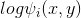
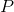
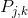
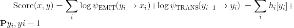

# 高级：制定动态决策和BI-LSTM CRF
## 1.动态与静态深度学习工具包
Pytorch是一种*动态*神经网络套件。另一个动态套件的例子是[Dynet](https://github.com/clab/dynet)（我之所以提到这一点，因为与
Pytorch和Dynet一起使用是相似的。如果你在Dynet中看到一个例子，它可能会帮助你在Pytorch中实现它）。相反的是*静态*工具包，其中包
括Theano，Keras，TensorFlow等。核心区别如下：
* 在静态工具包中，您可以定义一次计算图，对其进行编译，然后将实例流式传输给它。
* 在动态工具包中，为每个实例定义计算图。它永远不会被编译并且是即时执行的。

在没有很多经验的情况下，很难理解其中的差异。一个例子是假设我们想要构建一个深层组成解析器。假设我们的模型大致涉及以下步骤：
* 我们自底向上地建造树
* 标记根节点（句子的单词）
* 从那里，使用神经网络和单词的嵌入来找到形成组成部分的组合。每当你形成一个新的成分时，使用某种技术来嵌入成分。在这种情况下，
我们的网络架构将完全取决于输入句子。在“The green cat scratched the wall”一句中，在模型中的某个点上，我们想要结合跨度.gif)
（即，NP 组成部分跨越单词1到单词3，在这种情况下是“The green cat”）。

然而，另一句话可能是“Somewhere, the big fat cat scratched the wall”。在这句话中，我们希望在某个时刻形成组成.gif)。
我们想要形成的成分将取决于实例。如果我们只编译计算图一次，就像在静态工具包中那样，但编写这个逻辑将非常困难或者说是不可能的。
但是，在动态工具包中，不仅有1个预定义的计算图。每个实例都可以有一个新的计算图，所以这个问题就消失了。

动态工具包还具有易于调试和代码更接近宿主语言的优点（我的意思是Pytorch和Dynet看起来更像是比Keras或Theano更实际的Python代码）。

## 2.Bi-LSTM条件随机场讨论
对于本节，我们将看到用于命名实体识别的Bi-LSTM条件随机场的完整复杂示例。虽然上面的LSTM标记符通常足以用于词性标注，但是像CRF这样的
序列模型对于NER上的强大性能非常重要。CRF，虽然这个名字听起来很可怕，但所有模型都是CRF，在LSTM中提供了这些功能。CRF是一个高级模型，
比本教程中的任何早期模型复杂得多。如果你想跳过它，也可以。要查看您是否准备好，请查看是否可以：

* 在步骤i中为标记k写出维特比变量的递归。
* 修改上述重复以计算转发变量。
* 再次修改上面的重复计算以计算日志空间中的转发变量（提示：log-sum-exp）

如果你可以做这三件事，你应该能够理解下面的代码。回想一下，CRF计算条件概率。设为标签序列，
为字的输入序列。然后我们计算

.gif)

通过定义一些对数电位来确定得分:

.gif)

为了使分区功能易于处理，电位必须仅查看局部特征。

在Bi-LSTM CRF中，我们定义了两种潜力：发射和过渡。索引处的单词的发射电位来自时间步长处
的Bi-LSTM的隐藏状态。转换分数存储在矩阵中，其中是标记集。在我们的
实现中，是从标签 转换到标签的分数。所以：



在第二个表达式中，我们将标记视为分配了唯一的非负索引。

如果上面的讨论过于简短，你可以查看[这个](http://www.cs.columbia.edu/~mcollins/crf.pdf)，是迈克尔柯林斯写的关于CRF的文章。

## 3.实现说明
下面的示例实现了日志空间中的前向算法来计算分区函数，以及用于解码的维特比算法。反向传播将自动为我们计算梯度。我们不需要手工做任何事情。

这个实现冰未优化。如果您了解发生了什么，您可能会很快发现在前向算法中迭代下一个标记可能是在一个大的操作中完成的。我想编码更具可读性。
如果您想进行相关更改，可以将此标记器用于实际任务。

#### 3.1 导包
```buildoutcfg
# Author: Robert Guthrie

import torch
import torch.autograd as autograd
import torch.nn as nn
import torch.optim as optim

torch.manual_seed(1)
```

#### 3.2 辅助函数
辅助函数的功能是使代码更具可读性。

```buildoutcfg
def argmax(vec):
    # 将argmax作为python int返回
    _, idx = torch.max(vec, 1)
    return idx.item()


def prepare_sequence(seq, to_ix):
    idxs = [to_ix[w] for w in seq]
    return torch.tensor(idxs, dtype=torch.long)


# 以正向算法的数值稳定方式计算log sum exp
def log_sum_exp(vec):
    max_score = vec[0, argmax(vec)]
    max_score_broadcast = max_score.view(1, -1).expand(1, vec.size()[1])
    return max_score + \
        torch.log(torch.sum(torch.exp(vec - max_score_broadcast)))
```

#### 3.3 创建模型

```buildoutcfg
class BiLSTM_CRF(nn.Module):

    def __init__(self, vocab_size, tag_to_ix, embedding_dim, hidden_dim):
        super(BiLSTM_CRF, self).__init__()
        self.embedding_dim = embedding_dim
        self.hidden_dim = hidden_dim
        self.vocab_size = vocab_size
        self.tag_to_ix = tag_to_ix
        self.tagset_size = len(tag_to_ix)

        self.word_embeds = nn.Embedding(vocab_size, embedding_dim)
        self.lstm = nn.LSTM(embedding_dim, hidden_dim // 2,
                            num_layers=1, bidirectional=True)

        # 将LSTM的输出映射到标记空间。
        self.hidden2tag = nn.Linear(hidden_dim, self.tagset_size)

        # 转换参数矩阵。 输入i，j是得分从j转换到i。
        self.transitions = nn.Parameter(
            torch.randn(self.tagset_size, self.tagset_size))

        # 这两个语句强制执行我们从不转移到开始标记的约束
        # 并且我们永远不会从停止标记转移
        self.transitions.data[tag_to_ix[START_TAG], :] = -10000
        self.transitions.data[:, tag_to_ix[STOP_TAG]] = -10000

        self.hidden = self.init_hidden()

    def init_hidden(self):
        return (torch.randn(2, 1, self.hidden_dim // 2),
                torch.randn(2, 1, self.hidden_dim // 2))

    def _forward_alg(self, feats):
        # 使用前向算法来计算分区函数
        init_alphas = torch.full((1, self.tagset_size), -10000.)
        # START_TAG包含所有得分.
        init_alphas[0][self.tag_to_ix[START_TAG]] = 0.

        # 包装一个变量，以便我们获得自动反向提升
        forward_var = init_alphas

        # 通过句子迭代
        for feat in feats:
            alphas_t = []  # The forward tensors at this timestep
            for next_tag in range(self.tagset_size):
                # 广播发射得分：无论以前的标记是怎样的都是相同的
                emit_score = feat[next_tag].view(
                    1, -1).expand(1, self.tagset_size)
                # trans_score的第i个条目是从i转换到next_tag的分数
                trans_score = self.transitions[next_tag].view(1, -1)
                # next_tag_var的第i个条目是我们执行log-sum-exp之前的边（i -> next_tag）的值
                next_tag_var = forward_var + trans_score + emit_score
                # 此标记的转发变量是所有分数的log-sum-exp。
                alphas_t.append(log_sum_exp(next_tag_var).view(1))
            forward_var = torch.cat(alphas_t).view(1, -1)
        terminal_var = forward_var + self.transitions[self.tag_to_ix[STOP_TAG]]
        alpha = log_sum_exp(terminal_var)
        return alpha

    def _get_lstm_features(self, sentence):
        self.hidden = self.init_hidden()
        embeds = self.word_embeds(sentence).view(len(sentence), 1, -1)
        lstm_out, self.hidden = self.lstm(embeds, self.hidden)
        lstm_out = lstm_out.view(len(sentence), self.hidden_dim)
        lstm_feats = self.hidden2tag(lstm_out)
        return lstm_feats

    def _score_sentence(self, feats, tags):
        # Gives the score of a provided tag sequence
        score = torch.zeros(1)
        tags = torch.cat([torch.tensor([self.tag_to_ix[START_TAG]], dtype=torch.long), tags])
        for i, feat in enumerate(feats):
            score = score + \
                self.transitions[tags[i + 1], tags[i]] + feat[tags[i + 1]]
        score = score + self.transitions[self.tag_to_ix[STOP_TAG], tags[-1]]
        return score

    def _viterbi_decode(self, feats):
        backpointers = []

        # Initialize the viterbi variables in log space
        init_vvars = torch.full((1, self.tagset_size), -10000.)
        init_vvars[0][self.tag_to_ix[START_TAG]] = 0

        # forward_var at step i holds the viterbi variables for step i-1
        forward_var = init_vvars
        for feat in feats:
            bptrs_t = []  # holds the backpointers for this step
            viterbivars_t = []  # holds the viterbi variables for this step

            for next_tag in range(self.tagset_size):
                # next_tag_var [i]保存上一步的标签i的维特比变量
                # 加上从标签i转换到next_tag的分数。
                # 我们这里不包括emission分数，因为最大值不依赖于它们（我们在下面添加它们）
                next_tag_var = forward_var + self.transitions[next_tag]
                best_tag_id = argmax(next_tag_var)
                bptrs_t.append(best_tag_id)
                viterbivars_t.append(next_tag_var[0][best_tag_id].view(1))
            # 现在添加emission分数，并将forward_var分配给我们刚刚计算的维特比变量集
            forward_var = (torch.cat(viterbivars_t) + feat).view(1, -1)
            backpointers.append(bptrs_t)

        # 过渡到STOP_TAG
        terminal_var = forward_var + self.transitions[self.tag_to_ix[STOP_TAG]]
        best_tag_id = argmax(terminal_var)
        path_score = terminal_var[0][best_tag_id]

        # 按照后退指针解码最佳路径。
        best_path = [best_tag_id]
        for bptrs_t in reversed(backpointers):
            best_tag_id = bptrs_t[best_tag_id]
            best_path.append(best_tag_id)
        # 弹出开始标记（我们不想将其返回给调用者）
        start = best_path.pop()
        assert start == self.tag_to_ix[START_TAG]  # Sanity check
        best_path.reverse()
        return path_score, best_path

    def neg_log_likelihood(self, sentence, tags):
        feats = self._get_lstm_features(sentence)
        forward_score = self._forward_alg(feats)
        gold_score = self._score_sentence(feats, tags)
        return forward_score - gold_score

    def forward(self, sentence):  # dont confuse this with _forward_alg above.
        # 获取BiLSTM的emission分数
        lstm_feats = self._get_lstm_features(sentence)

        # 根据功能，找到最佳路径。
        score, tag_seq = self._viterbi_decode(lstm_feats)
        return score, tag_seq
```

#### 3.4 进行训练

```buildoutcfg
START_TAG = "<START>"
STOP_TAG = "<STOP>"
EMBEDDING_DIM = 5
HIDDEN_DIM = 4

# 弥补一些训练数据
training_data = [(
    "the wall street journal reported today that apple corporation made money".split(),
    "B I I I O O O B I O O".split()
), (
    "georgia tech is a university in georgia".split(),
    "B I O O O O B".split()
)]

word_to_ix = {}
for sentence, tags in training_data:
    for word in sentence:
        if word not in word_to_ix:
            word_to_ix[word] = len(word_to_ix)

tag_to_ix = {"B": 0, "I": 1, "O": 2, START_TAG: 3, STOP_TAG: 4}

model = BiLSTM_CRF(len(word_to_ix), tag_to_ix, EMBEDDING_DIM, HIDDEN_DIM)
optimizer = optim.SGD(model.parameters(), lr=0.01, weight_decay=1e-4)

# 在训练前检查预测
with torch.no_grad():
    precheck_sent = prepare_sequence(training_data[0][0], word_to_ix)
    precheck_tags = torch.tensor([tag_to_ix[t] for t in training_data[0][1]], dtype=torch.long)
    print(model(precheck_sent))

# 确保加载LSTM部分中较早的prepare_sequence
for epoch in range(
        300):  # again, normally you would NOT do 300 epochs, it is toy data
    for sentence, tags in training_data:
        # 步骤1. 请记住，Pytorch积累了梯度
        # We need to clear them out before each instance
        model.zero_grad()

        # 步骤2. 为我们为网络准备的输入，即将它们转换为单词索引的张量.
        sentence_in = prepare_sequence(sentence, word_to_ix)
        targets = torch.tensor([tag_to_ix[t] for t in tags], dtype=torch.long)

        # 步骤3. 向前运行
        loss = model.neg_log_likelihood(sentence_in, targets)

        # 步骤4.通过调用optimizer.step（）来计算损失，梯度和更新参数
        loss.backward()
        optimizer.step()

# 训练后检查预测
with torch.no_grad():
    precheck_sent = prepare_sequence(training_data[0][0], word_to_ix)
    print(model(precheck_sent))
# 得到结果
```

* 输出结果

```buildoutcfg
(tensor(2.6907), [1, 2, 2, 2, 2, 2, 2, 2, 2, 2, 1])
(tensor(20.4906), [0, 1, 1, 1, 2, 2, 2, 0, 1, 2, 2])
```

## 4.练习：区分标记的新损失函数
我们没有必要在进行解码时创建计算图，因为我们不会从维特比路径得分反向传播。因为无论如何我们都有它，尝试训练标记器，其中损失函
数是Viterbi path得分和gold-standard得分之间的差异。应该清楚的是，当预测的标签序列是正确的标签序列时，该功能是非负值和0。这基
本上是*结构感知器*。

由于已经实现了Viterbi和score_sentence，因此这种修改应该很短。这是一个关于计算图形的形状*取决于训练实例*的示例。虽然我没有尝
试在静态工具包中实现它，但我想它是可以的但可能没有那么容易。

拿起一些真实数据并进行比较！
