# 1. 安装Anaconda 3.5
Anaconda是一个用于科学计算的Python发行版，支持Linux、Mac和Window系统，提供了包管理与环境管理的功能，可以很方便地解决Python并存、切换，以及各种第三方包安装的问题。
## 1.1 下载：
可以直接从 [Anaconda官网](https://www.continuum.io/downloads)下载，但因为Anaconda的服务器在国外，所以下载速度会很慢，这里推荐使用[清华的镜像](https://mirrors.tuna.tsinghua.edu.cn/anaconda/archive/)来下载。选择合适你的版本下载，我这里选择[Anaconda3-5.1.0-Windows-x86_64.exe](https://mirrors.tuna.tsinghua.edu.cn/anaconda/archive/Anaconda3-5.1.0-Windows-x86_64.exe "Anaconda3-5.1.0-Windows-x86_64.exe")

## 1.2 安装
下载之后，点击安装即可，步骤依次如下：

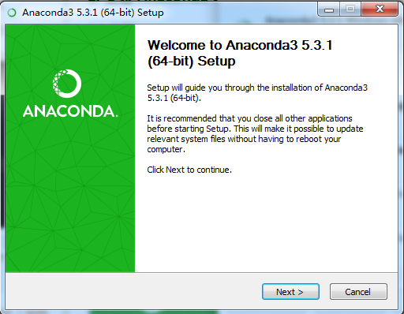

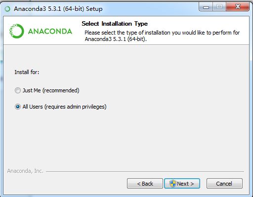

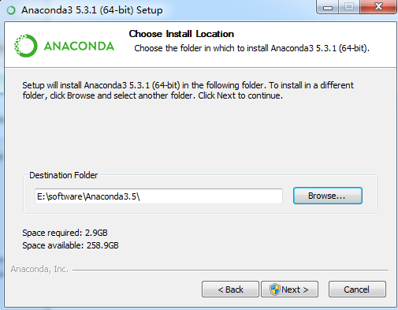

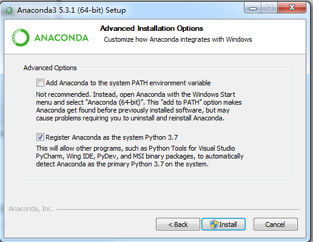

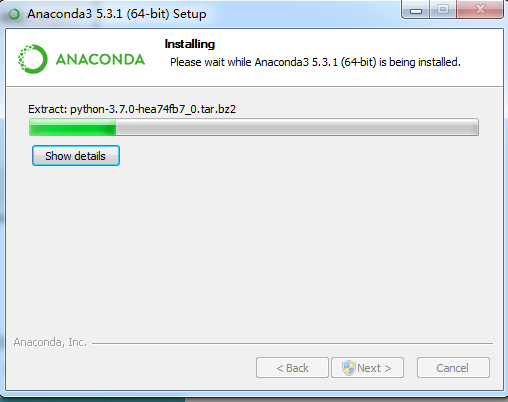

安装完成后，进行Anaconda的环境变量配置，打开控制面板->高级系统设置->环境变量->系统变量找到Path，点击编辑，加入三个文件夹的存储路径（注意三个路径之间需用分号隔开），步骤如下：

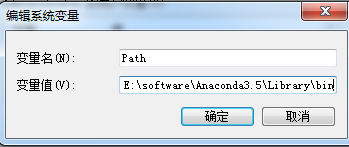

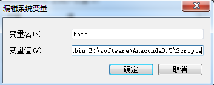

至此，Anaconda 3.5 windows版就安装设置好了，打开程序找到Anaconda Navigator，启动后可以看到：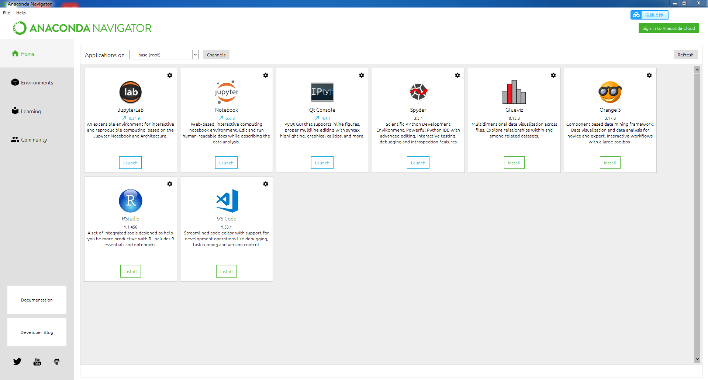

# 2. 安装PyTorch & torchvision
## 2.1 命令获取
进入 [PyTorch官网]( https://pytorch.org/)，依次选择你电脑的配置（我这里已经下载了python3.7），这里提供使用pip和conda两种环境下安装的步骤截图
### (1)使用pip：windows+pip+python3.7+None

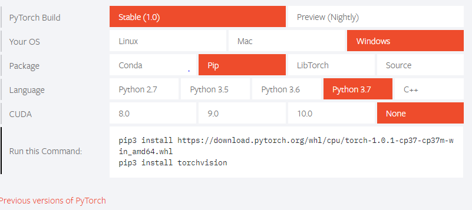

拷贝给出的命令在cmd下运行

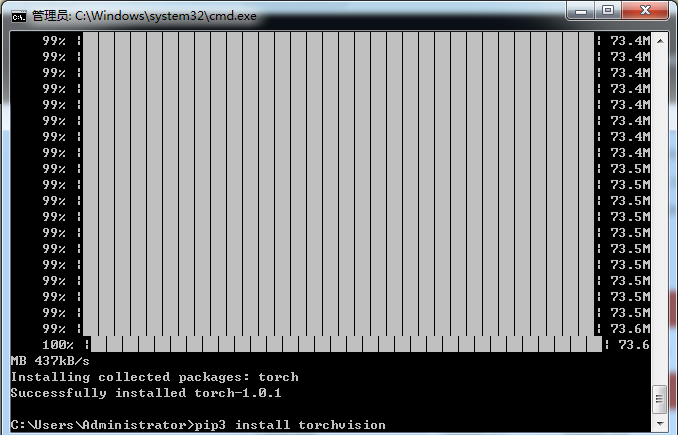

安装成功后检验是否安装成功，打开pycharm运行一个小demo：

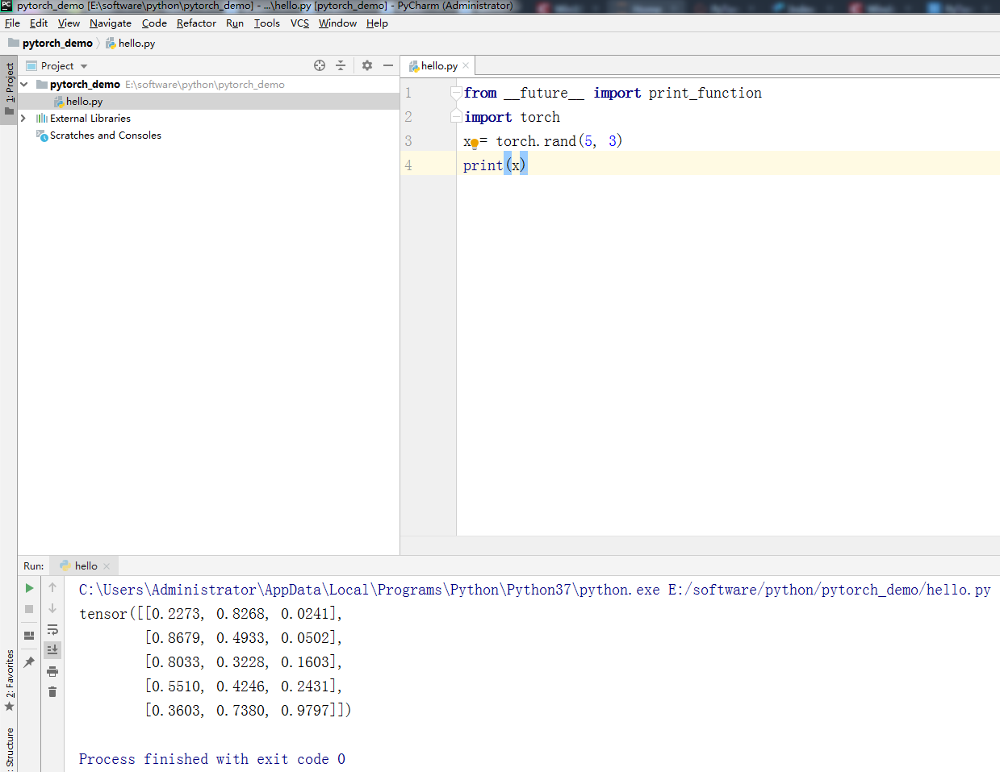

### (2)使用conda：windows+conda+python3.7+None

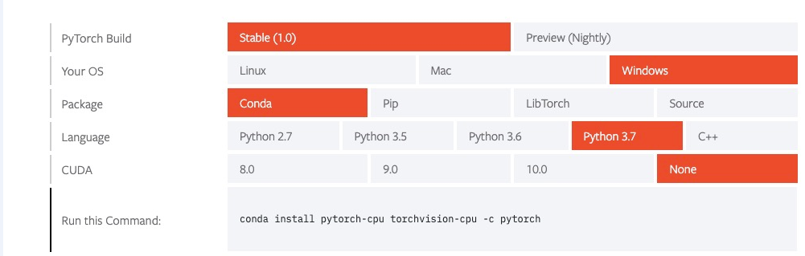

拷贝给出的命令在cmd下运行

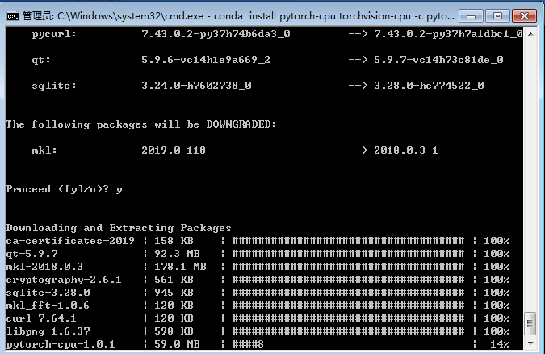

安装完毕后，验证是否安装成功，打开Anaconda的Jupyter新建python文件，运行demo：

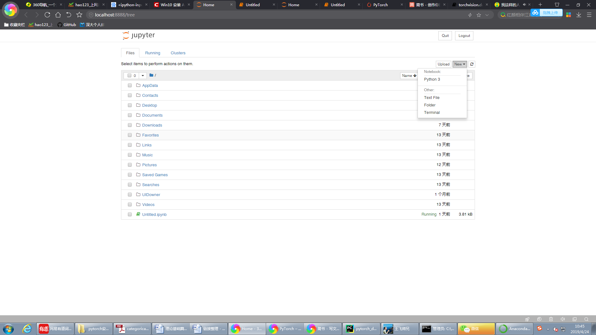

出现这个结果，那么恭喜你，至此PyTorch1.0 & Anaconda3.5已经安装成功。
