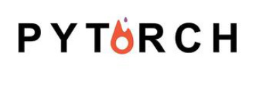

# PyTorch简介
要介绍PyTorch之前，不得不说一下Torch。Torch是一个有大量机器学习算法支持的科学计算框架，是一个与Numpy类似的张量（Tensor）
操作库，其特点是特别灵活，但因其采用了小众的编程语言是Lua，所以流行度不高，这也就有了PyTorch的出现。所以其实Torch是
PyTorch的前身，它们的底层语言相同，只是使用了不同的上层包装语言。

PyTorch是一个基于Torch的Python开源机器学习库，用于自然语言处理等应用程序。它主要由Facebookd的人工智能小组开发，不仅能够
实现强大的GPU加速，同时还支持动态神经网络，这一点是现在很多主流框架如TensorFlow都不支持的。
PyTorch提供了两个高级功能：
* 具有强大的GPU加速的张量计算（如Numpy）
* 包含自动求导系统的深度神经网络

除了Facebook之外，Twitter、GMU和Salesforce等机构都采用了PyTorch。

TensorFlow和Caffe都是命令式的编程语言，而且是静态的，首先必须构建一个神经网络，然后一次又一次使用相同的结构，如果想要改
变网络的结构，就必须从头开始。但是对于PyTorch，通过反向求导技术，可以让你零延迟地任意改变神经网络的行为，而且其实现速度
快。正是这一灵活性是PyTorch对比TensorFlow的最大优势。

另外，PyTorch的代码对比TensorFlow而言，更加简洁直观，底层代码也更容易看懂，这对于使用它的人来说理解底层肯定是一件令人激
动的事。

所以，总结一下PyTorch的优点：
* 支持GPU
* 灵活，支持动态神经网络
* 底层代码易于理解
* 命令式体验
* 自定义扩展

当然，现今任何一个深度学习框架都有其缺点，PyTorch也不例外，对比TensorFlow，其全面性处于劣势，目前PyTorch还不支持快速傅里
叶、沿维翻转张量和检查无穷与非数值张量；针对移动端、嵌入式部署以及高性能服务器端的部署其性能表现有待提升；其次因为这个框
架较新，使得他的社区没有那么强大，在文档方面其C库大多数没有文档。