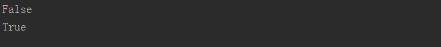
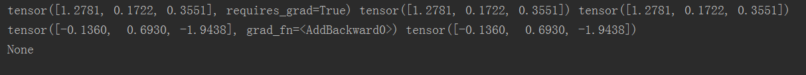

# Autograd

## 什么是Autograd

   Autograd(自动微分) 包是 PyTorch 中所有神经网络的核心。Tensor是PyTorch实现多维数组计算和自动微分的关键数据结构，关于
Tensor的各种数学运算，上一小节已做说明。本小节主要讲Tensor提供的自动微分，记录作用于Tensor上的所有操作，用于后续的梯度计算，这意味着以代码运行方式定义你的后向传播，并且每次迭代都可以不同。
   Autograd机制记录作用于Tensor上的所有操作，生成一个动态计算图。图的叶子节点是输入的数据，根节点是输出的结果。当在
根节点调用.backward()的时候就会从根到叶应用链式法则计算梯度。默认情况下，只有.requires_grad和is_leaf两个属性都为True的
节点才会被计算导数，并存储到grad中。
 
 ### requires_grad属性
 
   requires_grad属性默认为False，如果一个节点的requires_grad是True，那么所有依赖它的节点requires_grad也会是True。
   
```buildoutcfg
    x = torch.randn(5, 5)  # requires_grad=False by default
    y = torch.randn(5, 5)  # requires_grad=False by default
    z = torch.randn((5, 5), requires_grad=True)
    a = x + y
    print(a.requires_grad)

    b = a + z
    print(b.requires_grad)
```

输出结果：



### Function类

    每当对Tensor施加一个运算的时候，就会产生一个Function对象，它产生运算的结果，记录运算的发生，并且记录运算的输入。
Tensor使用.grad_fn属性记录这个计算图的入口。反向传播过程中，autograd引擎会按照逆序，通过Function的backward依次计算梯度。

<h4>1.backward()函数计算张量的梯度之和
    
     参数tensors如果是标量,函数backward计算参数tensors对于给定图叶子节点的梯度。参数tensors如果不是标量，需要另外指定参
 数grad_tensors，参数grad_tensors必须和参数tensors的长度相同。这种情况下将计算雅可比矢量乘积。
    每次backward之前，需要注意叶子梯度节点是否清零，如果没有清零，第二次backward会累计上一次的梯度。
  
  ```buildoutcfg
     x=torch.randn((3),dtype=torch.float32,requires_grad=True)
     y = torch.randn((3),dtype=torch.float32,requires_grad=True)
     z = torch.randn((3),dtype=torch.float32,requires_grad=True)
     t = x + y
     loss = t.dot(z)  #求向量的内积
     
     loss.backward(retain_graph=True)
     print(z,x.grad,y.grad) 
     print(t,z.grad)   
     print(t.grad)     
```

我们手动计算上面代码的导数可得为z，所以预期结果中z=x.grad=y.grad ; t=z.grad，且t为非叶子节点，即t.grad=None

输出结果：



<h4>2.detach()函数停止记录在tensor上的操作


<h4>3.grad()函数累计输入的梯度