# Tensor

## 什么是Tensor
Tensor（张量）是PyTorch最基本的操作对象，表示的是一个多维的矩阵，比如零维就是一个点，一维就向量，二维就是一般的矩阵，多维就相当于一个多维的数组，与python的numpy是对应的，而且PyTorch的Tensor可以和numpy的ndarray相互转换，唯一不同的是PyTorch可以再GPU上运行，而numpy的ndarray只能在CPU上运行。

## Tensor的基本数据类型
* 32位浮点型  torch.FloatTensor（默认）
* 64位浮点型 torch.DoubleTensor
* 16位整型  torch.ShortTensor
* 32位整型 torch.IntTensor
* 64位整型 torch.LongTensor

## Tensor的常用函数
要想对tensor进行操作，首先需引入torch包

```buildoutcfg
from __future__ import print_function
import torch
```
### 矩阵构建

<h4>1.torch.empty():构造无初始化的矩阵

```buildoutcfg
x = torch.empty(5, 3)
print(x)
```
输出结果：

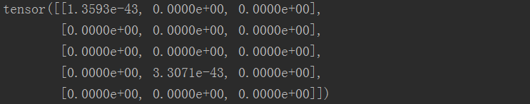

<h4>2.torch.rand():构建随机初始化矩阵

```buildoutcfg
x = torch.rand(5, 3)
print(x)
```
输出结果：

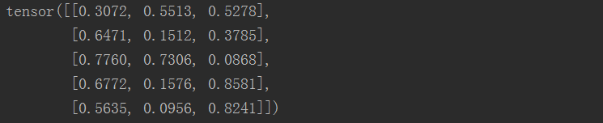

<h4>3.torch.randn():构造满足元素均值为0，方差为1的正态分布的Tensor
```buildoutcfg
x = torch.randn(2,3)
print(x)
```

输出结果：

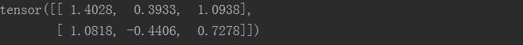

<h4>3.torch.zeros():构造元素值全为0的矩阵

```buildoutcfg
# 5x3矩阵，且数据类型为long
x = torch.zeros(5, 3, dtype=torch.long)
print(x)
```
输出结果：

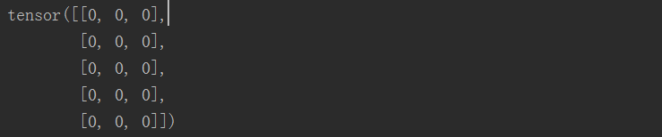

<h4>4.torch.tensor():创建张量，并自定义数据

```buildoutcfg
x = torch.tensor([5.5, 3])
print(x)
```
输出结果：

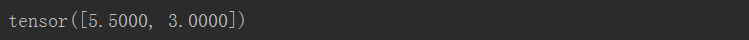

<h4>5.torch.randn_like():基于已有的tensor创建新的tensor

```buildoutcfg
x = x.new_ones(5, 3, dtype=torch.double)
print(x)

x = torch.randn_like(x, dtype=torch.float)
# 重写了数据类型
print(x)
# 矩阵的大小相同
```
输出结果：

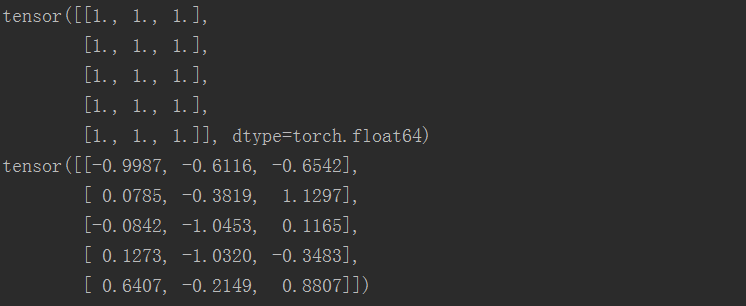

### 获取tensor的维度

```buildoutcfg
print(x.size())
```
输出结果：

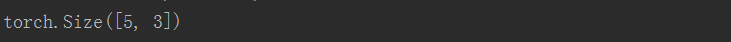

### Tensor的运算

#### 加法运算
<h4>1.直接使用“+”运算符

```buildoutcfg
y = torch.rand(5, 3)
print(x + y)
```
<h4>2.使用add()函数

```
print(torch.add(x, y))
```

<h4>3.提供一个输出tensor作为参数

```buildoutcfg
result = torch.empty(5, 3)
torch.add(x, y, out=result)
print(result)
```
<h4>4.使用add_()函数做加法，并取代原张量

```buildoutcfg
# adds x to y
y.add_(x)
print(y)
```
输出结果：

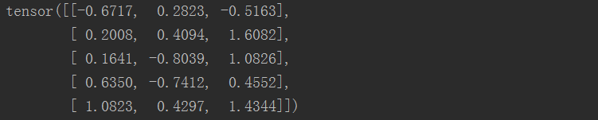

注意：任何使张量发生变化的操作都有一个前缀'_'。例如：x_copy_(y),x_t()，将会改变x

### 绝对值运算

<h4> torch.abs()输出全部张量元素的绝对值

```
x = torch.randn(2,3)
print(x)
y = torch.abs(x)
print(y)
```

输出结果：

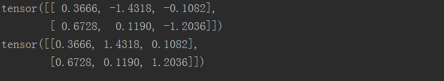

### 求商运算

<h4> torch.div()将输入参数的求商结果输出

```buildoutcfg
x = torch.randn(2,3)
print(x)
 
y = torch.randn(2,3)
print(y)
 
z = torch.div(x,y)
print(z)
```

输出结果：

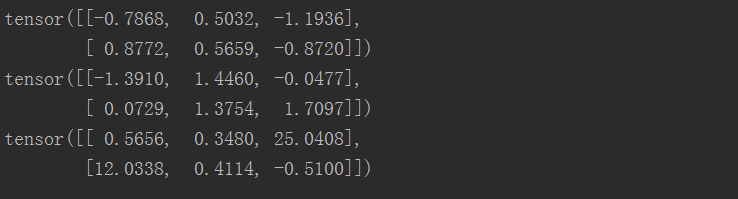

### 求积运算

<h4>1.torch.mul()返回输入参数的求积结果

```buildoutcfg
x = torch.randn(2,3)
print(x)
 
y = torch.randn(2,3)
print(y)
 
z = torch.mul(x,y)
print(z)
```

输出结果：


<h4>2.torch.mm()返回输入参数的求积结果,但被传入的参数会被当作矩阵进行处理，要求前一个矩阵的行数必须和后一个矩阵的列数相等
```buildoutcfg
x = torch.randn(2,3)
print(x)
 
y = torch.randn(3,2)
print(y)
 
z = torch.mm(x,y)
print(z)
```

输出结果：

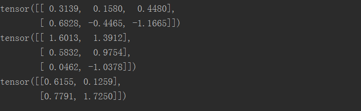

<h4>3.torch.m()返回输入参数的求积结果，但是运用矩阵与向量之间的乘法规则进行计算

```buildoutcfg
x = torch.randn(2,3)
print(x)
 
y = torch.randn(3)
print(y)
 
#被传入的参数中的第1个参数代表矩阵，第2个参数代表向量，顺序不能颠倒。
z = torch.mv(x,y)
print(z)
```

输出结果：

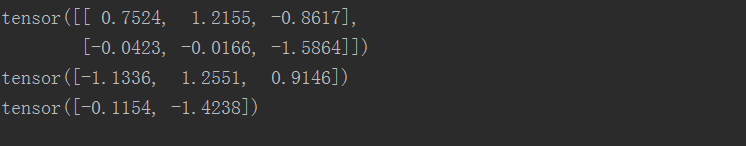

### 求幂运算

<h4>torch.pow()返回输入参数的求幂结果

```buildoutcfg
x = torch.randn(2,3)
print(x)
 
#可以是Tensor数据类型的变量和标量的组合
y = torch.pow(x,2)
print(y)
```

输出结果：

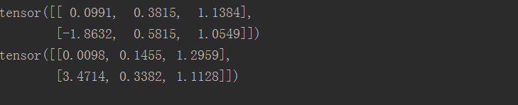

### 索引操作

tensor的索引操作与numpy类似

```buildoutcfg
#切片：取tensor矩阵每行的第二个元素作为输出
print(x[:,1])
```
输出结果：

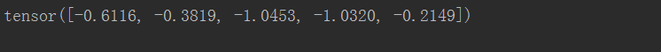

### 裁剪Tensor

torch.clamp():需要三个参数，分别是需要进行裁剪的Tensor数据类型的变量、裁剪的上边界和下边界

```buildoutcfg
x = torch.randn(2,3)
print(x) 

z = torch.clamp(x,-0.1,0.1)
print(z)

```

输出结果：

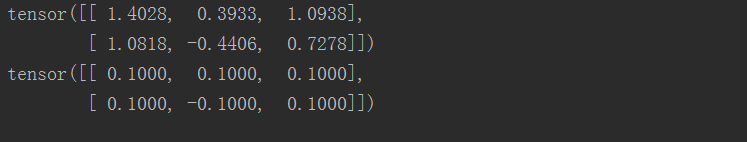

### 改变Tensor的大小或形状

```buildoutcfg
x = torch.randn(4, 4)
y = x.view(16)
z = x.view(-1, 8)  # the size -1 is inferred from other dimensions
print(x.size(), y.size(), z.size())
```
输出结果：

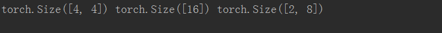

### 获取tensor的value值

```buildoutcfg
x = torch.randn(1)
print(x)
print(x.item())
```
输出结果：

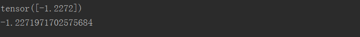

### 对tensor中的元素重新赋值

```buildoutcfg
x = torch.rand(5, 3)
print(x)
x[0,1] = 100
print(x)

```

输出结果：

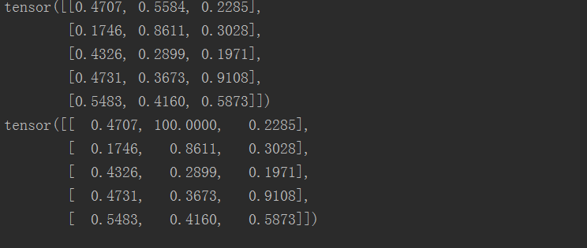
