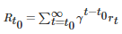
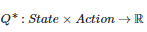
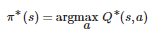
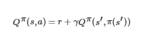
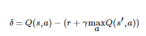
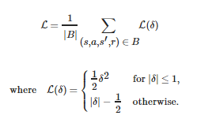
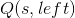
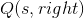
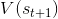

# 强化学习（DQN）教程
本教程介绍如何使用PyTorch从[OpenAI Gym](https://gym.openai.com/)中的 CartPole-v0 任务上训练一个Deep Q Learning (DQN) 代理。

## 1.任务

代理人必须在两个动作之间做出决定 - 向左或向右移动推车 - 以使连接到它的杆保持直立。您可以在[Gym](https://gym.openai.com/envs/CartPole-v0)
网站上找到官方排行榜，里面包含各种算法以及可视化。


当代理观察环境的当前状态并选择动作时，环境转换到新状态，并且还返回指示动作的后果的奖励。在此任务中，每增加一个时间步长的
奖励为+1，如果杆落得太远或者推车距离中心超过2.4个单位，则环境终止。这意味着更好的表现场景将持续更长的时间，以及积累更大的回报。

CartPole任务的设计使得代理的输入是4个实际值，表示环境状态（位置，速度等）。然而，神经网络可以纯粹通过观察场景来解决任务，
因此我们将使用以cart为中心的屏幕补丁作为输入。也因为如此，我们的结果与官方排行榜的结果无法直接比较 - 因为我们的任务
要困难得多。而且不幸的是，这确实减慢了训练速度，因为我们必须渲染所有帧。

严格地说，我们将状态显示为当前屏幕补丁与前一个补丁之间的差异。这将允许代理从一个图像中考虑杆的速度。

## 2.需要的包

首先，让我们导入所需的包。首先，我们需要[gym](https://gym.openai.com/docs)来得到环境（使用`pip install gym`）。我们还将
使用PyTorch中的以下内容：

* 神经网络(`torch.nn`)<br/>
* 优化(`torch.optim`)<br/>
* 自动分化（`torch.autograd`）<br/>
* 视觉任务的实用程序(`torchvision`)- 一个单独的包<br/>

```buildoutcfg
import gym
import math
import random
import numpy as np
import matplotlib
import matplotlib.pyplot as plt
from collections import namedtuple
from itertools import count
from PIL import Image

import torch
import torch.nn as nn
import torch.optim as optim
import torch.nn.functional as F
import torchvision.transforms as T


env = gym.make('CartPole-v0').unwrapped

# set up matplotlib
is_ipython = 'inline' in matplotlib.get_backend()
if is_ipython:
    from IPython import display

plt.ion()

# if gpu is to be used
device = torch.device("cuda" if torch.cuda.is_available() else "cpu")
```

## 3. 复现记忆（Replay Memory）
我们将使用经验重播记忆来训练我们的DQN。它存储代理观察到的转换，允许我们之后重用此数据。通过随机抽样，转换构建相关的一个批次。
已经表明经验重播记忆极大地稳定并改善了DQN训练程序。

为此，我们需要两个阶段：
* `Transition`：一个命名元组，表示我们环境中的单个转换。它实际上将（状态，动作）对映射到它们的（next_state，reward）结果，
状态是屏幕差异图像，如稍后所述<br/>
* `ReplayMemory`：有界大小的循环缓冲区，用于保存最近观察到的过渡。它还实现了一个`.sample()`方法，用于为训练选择随机batch
的转换。

```buildoutcfg
Transition = namedtuple('Transition',
                        ('state', 'action', 'next_state', 'reward'))


class ReplayMemory(object):

    def __init__(self, capacity):
        self.capacity = capacity
        self.memory = []
        self.position = 0

    def push(self, *args):
        """Saves a transition."""
        if len(self.memory) < self.capacity:
            self.memory.append(None)
        self.memory[self.position] = Transition(*args)
        self.position = (self.position + 1) % self.capacity

    def sample(self, batch_size):
        return random.sample(self.memory, batch_size)

    def __len__(self):
        return len(self.memory)
```

现在，让我们定义我们的模型。但首先，让我们快速回顾一下DQN是什么。

## 4. DQN 算法
我们的环境是确定性的，因此为了简单起见，这里给出的所有方程式也是确定性的。在强化学习文献中，它们还包含对环境中随机转变的
期望。

我们的目标是训练出一种政策，试图最大化折现累积奖励，其中也称为回报。折扣
应该是介于0和1之间的常数，以确保总和收敛。对于我们的代理来说，对比不确定的远期未来，它更看重它们相当有信心的不久的将来。

Q-learning背后的主要思想是，如果我们有一个函数，它可以告诉我们的回报是什么，如果我们要在给定状态下
采取行动，那么我们可以轻松地构建最大化我们奖励的政策：



但是，我们不了解世界的一切，因此我们无法访问。但是，由于神经网络是通用函数逼近器，我们可以简单地创建
一个并训练从而使得它类似于。

对于我们的训练更新规则，我们将使用一个事实，即某些策略的每个函数都服从 Bellman 方程：



平等的两边之间的差异被称为时间差异误差,:



为了最大限度地降低此错误，我们将使用[Huber损失](https://en.wikipedia.org/wiki/Huber_loss)。当误差很小时，Huber损失就像均
方误差一样，但是当误差很大时，就像平均绝对误差一样 - 当的估计噪声很多时，这使得它对异常值更加鲁棒。
我们通过从重放内存中采样的一批转换来计算：



## 5. Q_网络（Q_network）
我们的模型将是一个卷积神经网络，它接收当前和之前的屏幕补丁之间的差异。它有两个输出，分别代表和
（其中s是网络的输入）。实际上，网络正在尝试预测在给定当前输入的情况下采取每个动作的预期回报。

```buildoutcfg
class DQN(nn.Module):

    def __init__(self, h, w, outputs):
        super(DQN, self).__init__()
        self.conv1 = nn.Conv2d(3, 16, kernel_size=5, stride=2)
        self.bn1 = nn.BatchNorm2d(16)
        self.conv2 = nn.Conv2d(16, 32, kernel_size=5, stride=2)
        self.bn2 = nn.BatchNorm2d(32)
        self.conv3 = nn.Conv2d(32, 32, kernel_size=5, stride=2)
        self.bn3 = nn.BatchNorm2d(32)

        # 线性输入连接的数量取决于conv2d层的输出，因此取决于输入图像的大小，因此请对其进行计算。
        def conv2d_size_out(size, kernel_size = 5, stride = 2):
            return (size - (kernel_size - 1) - 1) // stride  + 1
        convw = conv2d_size_out(conv2d_size_out(conv2d_size_out(w)))
        convh = conv2d_size_out(conv2d_size_out(conv2d_size_out(h)))
        linear_input_size = convw * convh * 32
        self.head = nn.Linear(linear_input_size, outputs)

    # 使用一个元素调用以确定下一个操作，或在优化期间调用batch。返回tensor([[left0exp,right0exp]...]).
    def forward(self, x):
        x = F.relu(self.bn1(self.conv1(x)))
        x = F.relu(self.bn2(self.conv2(x)))
        x = F.relu(self.bn3(self.conv3(x)))
        return self.head(x.view(x.size(0), -1))
```

## 6. 输入提取
下面的代码是用于从环境中提取和处理渲染图像的实用程序。它使用了`torchvision`软件包，可以轻松构成图像变换。运行单元后，它将
显示一个提取的示例补丁。

```buildoutcfg
resize = T.Compose([T.ToPILImage(),
                    T.Resize(40, interpolation=Image.CUBIC),
                    T.ToTensor()])


def get_cart_location(screen_width):
    world_width = env.x_threshold * 2
    scale = screen_width / world_width
    return int(env.state[0] * scale + screen_width / 2.0)  # MIDDLE OF CART

def get_screen():
    # gym要求的返回屏幕是400x600x3，但有时更大，如800x1200x3。 将其转换为torch order（CHW）。
    screen = env.render(mode='rgb_array').transpose((2, 0, 1))
    # cart位于下半部分，因此不包括屏幕的顶部和底部
    _, screen_height, screen_width = screen.shape
    screen = screen[:, int(screen_height*0.4):int(screen_height * 0.8)]
    view_width = int(screen_width * 0.6)
    cart_location = get_cart_location(screen_width)
    if cart_location < view_width // 2:
        slice_range = slice(view_width)
    elif cart_location > (screen_width - view_width // 2):
        slice_range = slice(-view_width, None)
    else:
        slice_range = slice(cart_location - view_width // 2,
                            cart_location + view_width // 2)
    # 去掉边缘，使得我们有一个以cart为中心的方形图像
    screen = screen[:, :, slice_range]
    # 转换为float类型，重新缩放，转换为torch张量
    # (this doesn't require a copy)
    screen = np.ascontiguousarray(screen, dtype=np.float32) / 255
    screen = torch.from_numpy(screen)
    # 调整大小并添加batch维度（BCHW）
    return resize(screen).unsqueeze(0).to(device)


env.reset()
plt.figure()
plt.imshow(get_screen().cpu().squeeze(0).permute(1, 2, 0).numpy(),
           interpolation='none')
plt.title('Example extracted screen')
plt.show()
```

## 7. 训练
#### 7.1 超参数和实用程序
这个单元实例化我们的模型及其优化器，并定义了一些实用程序：
* `select_action`：将根据epsilon贪婪政策选择一项行动。简而言之，我们有时会使用我们的模型来选择动作，有时我们只会统一采样。
选择随机操作的概率将从`EPS_START`开始，并将以指数方式向`EPS_END`衰减。`EPS_DECAY`控制衰减的速度<br/>
* `plot_durations`：帮助绘制episodes的持续时间，以及过去100个episodes的平均值（官方评估中使用的度量）。该图将位于包含主
要训练循环的单元下方，并将在每个episodes后更新。<br/>

```buildoutcfg
BATCH_SIZE = 128
GAMMA = 0.999
EPS_START = 0.9
EPS_END = 0.05
EPS_DECAY = 200
TARGET_UPDATE = 10

# 获取屏幕大小，以便我们可以根据AI gym返回的形状正确初始化图层。 
# 此时的典型尺寸接近3x40x90
# 这是get_screen（）中的限幅和缩小渲染缓冲区的结果
init_screen = get_screen()
_, _, screen_height, screen_width = init_screen.shape

# 从gym行动空间中获取行动数量
n_actions = env.action_space.n

policy_net = DQN(screen_height, screen_width, n_actions).to(device)
target_net = DQN(screen_height, screen_width, n_actions).to(device)
target_net.load_state_dict(policy_net.state_dict())
target_net.eval()

optimizer = optim.RMSprop(policy_net.parameters())
memory = ReplayMemory(10000)


steps_done = 0


def select_action(state):
    global steps_done
    sample = random.random()
    eps_threshold = EPS_END + (EPS_START - EPS_END) * \
        math.exp(-1. * steps_done / EPS_DECAY)
    steps_done += 1
    if sample > eps_threshold:
        with torch.no_grad():
            # t.max(1)将返回每行的最大列值。 
            # 最大结果的第二列是找到最大元素的索引，因此我们选择具有较大预期奖励的行动。
            return policy_net(state).max(1)[1].view(1, 1)
    else:
        return torch.tensor([[random.randrange(n_actions)]], device=device, dtype=torch.long)


episode_durations = []


def plot_durations():
    plt.figure(2)
    plt.clf()
    durations_t = torch.tensor(episode_durations, dtype=torch.float)
    plt.title('Training...')
    plt.xlabel('Episode')
    plt.ylabel('Duration')
    plt.plot(durations_t.numpy())
    # 取100个episode的平均值并绘制它们
    if len(durations_t) >= 100:
        means = durations_t.unfold(0, 100, 1).mean(1).view(-1)
        means = torch.cat((torch.zeros(99), means))
        plt.plot(means.numpy())

    plt.pause(0.001)  # 暂停一下，以便更新图表
    if is_ipython:
        display.clear_output(wait=True)
        display.display(plt.gcf())
```

## 8. 训练循环
在这里，您可以找到执行优化的单个步骤的`optimize_model`函数。它首先对一个batch进行采样，将所有张量连接成一个整体，计算
和=.gif)，并将它们组合成我们的损失。通过定义，如果s是终端状态，则设置=0.gif)。我们还使
用目标网络来计算以增加稳定性。目标网络的权重在大多数时间保持冻结状态，但每隔一段时间就会更新策略
网络的权重。这通常是一系列步骤，但为了简单起见，我们将使用episodes。

```buildoutcfg
def optimize_model():
    if len(memory) < BATCH_SIZE:
        return
    transitions = memory.sample(BATCH_SIZE)
    # 转置batch（有关详细说明，请参阅https://stackoverflow.com/a/19343/3343043）。
    # 这会将过渡的batch数组转换为batch数组的过渡。
    batch = Transition(*zip(*transitions))

    # 计算非最终状态的掩码并连接batch元素（最终状态将是模拟结束后的状态）
    non_final_mask = torch.tensor(tuple(map(lambda s: s is not None,
                                          batch.next_state)), device=device, dtype=torch.uint8)
    non_final_next_states = torch.cat([s for s in batch.next_state
                                                if s is not None])
    state_batch = torch.cat(batch.state)
    action_batch = torch.cat(batch.action)
    reward_batch = torch.cat(batch.reward)

    # 计算Q(s_t，a) - 模型计算Q(s_t)，然后我们选择所采取的动作列。
    # 这些是根据policy_net对每个batch状态采取的操作
    state_action_values = policy_net(state_batch).gather(1, action_batch)

    # 计算所有下一个状态的V(s_{t+1})
    # non_final_next_states的操作的预期值是基于“较旧的”target_net计算的; 
    # 用max(1)[0]选择最佳奖励。这是基于掩码合并的，这样我们就可以得到预期的状态值，或者在状态是最终的情况下为0。
    next_state_values = torch.zeros(BATCH_SIZE, device=device)
    next_state_values[non_final_mask] = target_net(non_final_next_states).max(1)[0].detach()
    # 计算预期的Q值
    expected_state_action_values = (next_state_values * GAMMA) + reward_batch

    # 计算Huber损失
    loss = F.smooth_l1_loss(state_action_values, expected_state_action_values.unsqueeze(1))

    # 优化模型
    optimizer.zero_grad()
    loss.backward()
    for param in policy_net.parameters():
        param.grad.data.clamp_(-1, 1)
    optimizer.step()
```

下面，您可以找到主要的训练循环。在开始时，我们重置环境并初始`state`张量。然后，我们采样一个动作并执行它，观察下一个屏幕和
奖励（总是1），并优化我们的模型一次。当episode结束时（我们的模型失败），我们重新开始循环。

下面，*num_episodes*设置为小数值。您应该下载笔记本并运行更多的epsiodes，例如300+以进行有意义的持续时间改进。

```buildoutcfg
num_episodes = 50
for i_episode in range(num_episodes):
    # 初始化环境和状态
    env.reset()
    last_screen = get_screen()
    current_screen = get_screen()
    state = current_screen - last_screen
    for t in count():
        # 选择动作并执行
        action = select_action(state)
        _, reward, done, _ = env.step(action.item())
        reward = torch.tensor([reward], device=device)

        # 观察新的状态
        last_screen = current_screen
        current_screen = get_screen()
        if not done:
            next_state = current_screen - last_screen
        else:
            next_state = None

        # 在记忆中存储过渡
        memory.push(state, action, next_state, reward)

        # 移动到下一个状态
        state = next_state

        # 执行优化的一个步骤（在目标网络上）
        optimize_model()
        if done:
            episode_durations.append(t + 1)
            plot_durations()
            break
    # 更新目标网络，复制DQN中的所有权重和偏差
    if i_episode % TARGET_UPDATE == 0:
        target_net.load_state_dict(policy_net.state_dict())

print('Complete')
env.render()
env.close()
plt.ioff()
plt.show()
```

以下是说明整体结果数据流的图表。


可以随机选择或根据策略选择操作，从gym环境中获取下一步样本。我们将结果记录在重放内存中，并在每次迭代时运行优化步骤。优化从
重放内存中选择一个随机batch来进行新策略的训练。“较旧的”target_net也用于优化以计算预期的Q值; 它会偶尔更新以保持最新状态。