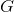
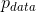
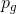
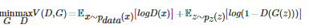
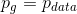
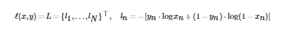
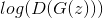
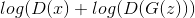

#  DCGAN教程
## 1. 简介
本教程通过一个例子来对 DCGANs 进行介绍。我们将会训练一个生成对抗网络（GAN）用于在展示了许多真正的名人的图片后产生新的名人。
这里的大部分代码来自[pytorch/examples](https://github.com/pytorch/examples)中的 dcgan 实现，本文档将对实现进行进行全面
的介绍，并阐明该模型的工作原理以及为什么如此。但是不需要担心，你并不需要事先了解 GAN，但可能需要花一些事件来推理一下底层
实际发生的事情。此外，为了有助于节省时间，最好是使用一个GPU，或者两个。让我们从头开始。

## 2. 生成对抗网络（Generative Adversarial Networks）
####  2.1 什么是 GAN
GANs是用于 DL （Deep Learning）模型去捕获训练数据分布情况的框架，以此我们可以从同一分布中生成新的数据。GANs是有Ian Goodfellow
于2014年提出，并且首次在论文[Generative Adversarial Nets](https://papers.nips.cc/paper/5423-generative-adversarial-nets.pdf)中
描述。它们由两个不同的模型组成，一个是生成器一个是判别器。生成器的工作是产生看起来像训练图像的“假”图像；判别器的工作是
查看图像并输出它是否是真实的训练图像或来自生成器的伪图像。在训练期间，产生器不断尝试通过产生越来越好的假动作来超越判别器，
而判别器则是为了更好地检测并准确地对真实和假图像进行分类。这个游戏的平衡是当生成器产生完美的假动作以使假图像看起来像是来自
训练数据，而判别器总是猜测生成器输出图像为真或假的概率为50%。

现在，我们开始定义在这个教程中使用到的一些符号。

* 判别器的符号定义

设表示代表一张图像的数据，.gif)
是判别器网络，它输出来自训练数据而不是生成器的（标量）概率。这里，由于我们处理图像，.gif)
的输入是 CHW 大小为3x64x64的图像。直观地，当来自训练数据时.gif)应该是 HIGH ，而当x来
自生成器时.gif)应该是 LOW。.gif)也可以被认为是传统的二元分类器。

* 生成器的符号定义

对于生成器的符号，让是从标准正态分布中采样的潜在空间矢量，.gif)表示将潜在向量
映射到数据空间的生成器函数，的目标是估计训练数据来自什么分布（），以便它可以
根据估计的分布（）生成假样本。

因此，.gif)是生成器的输出是真实图像的概率（标量）。正如[Goodfellow](https://papers.nips.cc/paper/5423-generative-adversarial-nets.pdf)
的论文中所描述的，和玩一个极小极大的游戏，其中试图最大化它正确地
分类真实数据和假样本.gif)的概率，并且试图最小化预测其输出是假的
概率)).gif)。从论文来看，GAN 损失函数是:



理论上，这个极小极大游戏的解决方案是，如果输入的是真实的或假的，则判别器会随机猜测。然而，GAN 
的收敛理论仍在积极研究中，实际上模型并不总是训练到这一点。

####  2.2 什么是 DCGAN
DCGAN 是上述 GAN 的直接扩展，区别的是它分别在判别器和生成器中明确地使用了卷积和卷积转置层。它首先是由Radford等人在论文
[Unsupervised Representation Learning With Deep Convolutional Generative Adversarial Networks](https://arxiv.org/pdf/1511.06434.pdf)
中提出。判别器由 *strided [convolution](https://pytorch.org/docs/stable/nn.html#torch.nn.Conv2d) layers*、*[batch norm](https://pytorch.org/docs/stable/nn.html#torch.nn.BatchNorm2d) layers* 
和 *[LeakyReLU](https://pytorch.org/docs/stable/nn.html#torch.nn.LeakyReLU) activations* 组成，它输入 3x64x64 的图像，
然后输出的是一个代表输入是来自实际数据分布的标量概率。生成器则是由 *[convolutional-transpose](https://pytorch.org/docs/stable/nn.html#torch.nn.ConvTranspose2d) layers*、 *batch norm layers* 
和 *[ReLU](https://pytorch.org/docs/stable/nn.html#relu) activations* 组成。它的输入是从标准正态分布中绘制的潜在向量，输出是 3x64x64 的 RGB 图像。*strided conv-transpose layers*
允许潜在标量转换成具有与图像相同形状的体积。在本文中，作者还提供了一些有关如何设置优化器，如何计算损失函数以及如何初始化
模型权重的提示，所有这些都将在后面的章节中进行说明。

```buildoutcfg
from __future__ import print_function
#%matplotlib inline
import argparse
import os
import random
import torch
import torch.nn as nn
import torch.nn.parallel
import torch.backends.cudnn as cudnn
import torch.optim as optim
import torch.utils.data
import torchvision.datasets as dset
import torchvision.transforms as transforms
import torchvision.utils as vutils
import numpy as np
import matplotlib.pyplot as plt
import matplotlib.animation as animation
from IPython.display import HTML

# 为再现性设置随机seem
manualSeed = 999
#manualSeed = random.randint(1, 10000) # 如果你想要新的结果就是要这段代码
print("Random Seed: ", manualSeed)
random.seed(manualSeed)
torch.manual_seed(manualSeed)
```

* 输出结果：

```buildoutcfg
Random Seed:  999
```

## 3. DCGAN实现过程
#### 3.1 输入
让我们定义输入数据去运行我们的教程：
 * **dataroot**：存放数据集根目录的路径。我们将在下一节中详细讨论数据集
 * **workers**：使用DataLoader加载数据的工作线程数
 * **batch_size**：训练中使用的batch大小。在DCGAN论文中batch的大小为128
 * **image_size**：用于训练的图像的空间大小。此实现默认 64x64。如果需要其他尺寸，则必须改变和
 的结构。有关详细信息，请参见[此处](https://github.com/pytorch/examples/issues/70)。
 * **nc**：输入图像中的颜色通道数。对于彩色图像，这是参数设置为3
 * **nz**：潜在向量的长度
 * **ngf**：与通过生成器携带的特征图的深度有关
 * **ndf**：设置通过判别器传播的特征映射的深度
 * **num_epochs**：要运行的训练的epoch数量。长时间的训练可能会带来更好的结果，但也需要更长的时间
 * **lr**：学习速率。如DCGAN论文中所述，此数字应为0.0002
 * **beta1**：适用于Adam优化器的beta1超参数。如论文所述，此数字应为0.5
 * **ngpu**：可用的GPU数量。如果为0，则代码将以CPU模式运行。如果此数字大于0，它将在该数量的GPU上运行
 
 ```buildoutcfg
# 数据集的根目录
dataroot = "data/celeba"

# 加载数据的工作线程数
workers = 2

# 训练期间的batch大小
batch_size = 128

# 训练图像的空间大小。所有图像将使用变压器调整为此大小。
image_size = 64

# 训练图像中的通道数。对于彩色图像，这是3
nc = 3

# 潜在向量 z 的大小(例如： 生成器输入的大小)
nz = 100

# 生成器中特征图的大小
ngf = 64

# 判别器中的特征映射的大小
ndf = 64

# 训练epochs的大小
num_epochs = 5

# 优化器的学习速率
lr = 0.0002

# 适用于Adam优化器的Beta1超级参数
beta1 = 0.5

# 可用的GPU数量。使用0表示CPU模式。
ngpu = 1
```

#### 3.2 数据
在本教程中，我们将使用[Celeb-A Faces](http://mmlab.ie.cuhk.edu.hk/projects/CelebA.html)数据集，该数据集可以在链接或Google Drive中下载。
数据集将下载为名为*img_align_celeba.zip*的文件。下载后，创建名为*celeba*的目录并将zip文件解压缩到该目录中。然后，将此笔记中
的数据对象输入设置为刚刚创建的celeba目录。生成的目录结构应该是：

```buildoutcfg
/path/to/celeba
    -> img_align_celeba
        -> 188242.jpg
        -> 173822.jpg
        -> 284702.jpg
        -> 537394.jpg
```
这是一个重要的步骤，因为我们将使用`ImageFolder`数据集类，它要求在数据集的根文件夹中有子目录。现在，我们可以创建数据集，创
建数据加载器，设置要运行的设备，以及最后可视化一些训练数据。

```buildoutcfg
# 我们可以按照设置的方式使用图像文件夹数据集。
# 创建数据集
dataset = dset.ImageFolder(root=dataroot,
                           transform=transforms.Compose([
                               transforms.Resize(image_size),
                               transforms.CenterCrop(image_size),
                               transforms.ToTensor(),
                               transforms.Normalize((0.5, 0.5, 0.5), (0.5, 0.5, 0.5)),
                           ]))
# 创建加载器
dataloader = torch.utils.data.DataLoader(dataset, batch_size=batch_size,
                                         shuffle=True, num_workers=workers)

# 选择我们运行在上面的设备
device = torch.device("cuda:0" if (torch.cuda.is_available() and ngpu > 0) else "cpu")

# 绘制部分我们的输入图像
real_batch = next(iter(dataloader))
plt.figure(figsize=(8,8))
plt.axis("off")
plt.title("Training Images")
plt.imshow(np.transpose(vutils.make_grid(real_batch[0].to(device)[:64], padding=2, normalize=True).cpu(),(1,2,0)))
```


## 3.3 实现
通过设置输入参数和准备好的数据集，我们现在可以进入真正的实现步骤。我们将从权重初始化策略开始，然后详细讨论生成器，鉴别器，
损失函数和训练循环。

#### 3.3.1 权重初始化
在`DCGAN`论文中，作者指出所有模型权重应从正态分布中随机初始化，mean = 0，stdev = 0.02。`weights_init`函数将初始化模型作为
输入，并重新初始化所有卷积，卷积转置和batch标准化层以满足此标准。初始化后立即将此函数应用于模型。

```buildoutcfg
# custom weights initialization called on netG and netD
def weights_init(m):
    classname = m.__class__.__name__
    if classname.find('Conv') != -1:
        nn.init.normal_(m.weight.data, 0.0, 0.02)
    elif classname.find('BatchNorm') != -1:
        nn.init.normal_(m.weight.data, 1.0, 0.02)
        nn.init.constant_(m.bias.data, 0)
```

#### 3.3.2 生成器
生成器用于将潜在空间矢量（）映射到数据空间。由于我们的数据是图像，因此将
转换为数据空间意味着最终创建与训练图像具有相同大小的RGB图像（即3x64x64）。实际上，这是通过一系列跨步的二维卷积转置层实现的，
每个转换层与二维批量标准层和relu activation进行配对。生成器的输出通过`tanh`函数输入，使其返回到[-1,1]范围的输入数据。值得
注意的是在转换层之后存在批量范数函数，因为这是DCGAN论文的关键贡献。这些层有助于训练期间的梯度流动。DCGAN论文中的生成器中
的图像如下所示：


 
> 请注意，我们对输入怎么设置（*nz*，*ngf*和*nc*）会影响代码中的生成器体系结构。*nz* 是输入向量的长度，
*ngf*与通过生成器传播的特征图的大小有关，*nc*是输出图像中的通道数（对于RGB图像，设置为3）。下面是生成器的代码。

* 生成器代码
```buildoutcfg
# 生成器代码
class Generator(nn.Module):
    def __init__(self, ngpu):
        super(Generator, self).__init__()
        self.ngpu = ngpu
        self.main = nn.Sequential(
            # 输入是Z，进入卷积
            nn.ConvTranspose2d( nz, ngf * 8, 4, 1, 0, bias=False),
            nn.BatchNorm2d(ngf * 8),
            nn.ReLU(True),
            # state size. (ngf*8) x 4 x 4
            nn.ConvTranspose2d(ngf * 8, ngf * 4, 4, 2, 1, bias=False),
            nn.BatchNorm2d(ngf * 4),
            nn.ReLU(True),
            # state size. (ngf*4) x 8 x 8
            nn.ConvTranspose2d( ngf * 4, ngf * 2, 4, 2, 1, bias=False),
            nn.BatchNorm2d(ngf * 2),
            nn.ReLU(True),
            # state size. (ngf*2) x 16 x 16
            nn.ConvTranspose2d( ngf * 2, ngf, 4, 2, 1, bias=False),
            nn.BatchNorm2d(ngf),
            nn.ReLU(True),
            # state size. (ngf) x 32 x 32
            nn.ConvTranspose2d( ngf, nc, 4, 2, 1, bias=False),
            nn.Tanh()
            # state size. (nc) x 64 x 64
        )

    def forward(self, input):
        return self.main(input)
```
 现在，我们可以实例化生成器并应用`weights_init`函数。查看打印的模型以查看生成器对象的结构。
 
 ```buildoutcfg
# 创建生成器
netG = Generator(ngpu).to(device)

# 如果需要，管理multi-gpu
if (device.type == 'cuda') and (ngpu > 1):
    netG = nn.DataParallel(netG, list(range(ngpu)))

# 应用weights_init函数随机初始化所有权重，mean= 0，stdev = 0.2。
netG.apply(weights_init)

# 打印模型
print(netG)
```

* 输出结果：

```buildoutcfg
Generator(
  (main): Sequential(
    (0): ConvTranspose2d(100, 512, kernel_size=(4, 4), stride=(1, 1), bias=False)
    (1): BatchNorm2d(512, eps=1e-05, momentum=0.1, affine=True, track_running_stats=True)
    (2): ReLU(inplace=True)
    (3): ConvTranspose2d(512, 256, kernel_size=(4, 4), stride=(2, 2), padding=(1, 1), bias=False)
    (4): BatchNorm2d(256, eps=1e-05, momentum=0.1, affine=True, track_running_stats=True)
    (5): ReLU(inplace=True)
    (6): ConvTranspose2d(256, 128, kernel_size=(4, 4), stride=(2, 2), padding=(1, 1), bias=False)
    (7): BatchNorm2d(128, eps=1e-05, momentum=0.1, affine=True, track_running_stats=True)
    (8): ReLU(inplace=True)
    (9): ConvTranspose2d(128, 64, kernel_size=(4, 4), stride=(2, 2), padding=(1, 1), bias=False)
    (10): BatchNorm2d(64, eps=1e-05, momentum=0.1, affine=True, track_running_stats=True)
    (11): ReLU(inplace=True)
    (12): ConvTranspose2d(64, 3, kernel_size=(4, 4), stride=(2, 2), padding=(1, 1), bias=False)
    (13): Tanh()
  )
)
```

#### 3.3.3 判别器
如上所述，判别器是二进制分类网络，它将图像作为输入并输出输入图像是真实的标量概率（与假的相反）。这里，
采用 3x64x64 的输入图像，通过一系列Conv2d，BatchNorm2d和LeakyReLU层处理它，并通过Sigmoid激活函数输出
最终概率。如果问题需要，可以使用更多层扩展此体系结构，但使用strided convolution（跨步卷积），BatchNorm和LeakyReLU具有重要
意义。DCGAN论文提到使用跨步卷积而不是池化到降低采样是一种很好的做法，因为它可以让网络学习自己的池化功能。批量标准和 leaky 
relu函数也促进良好的梯度流，这对于[](notation/G.gif)和[](notation/D.gif)的学习过程都是至关重要的。

* 判别器代码

```buildoutcfg
class Discriminator(nn.Module):
    def __init__(self, ngpu):
        super(Discriminator, self).__init__()
        self.ngpu = ngpu
        self.main = nn.Sequential(
            # input is (nc) x 64 x 64
            nn.Conv2d(nc, ndf, 4, 2, 1, bias=False),
            nn.LeakyReLU(0.2, inplace=True),
            # state size. (ndf) x 32 x 32
            nn.Conv2d(ndf, ndf * 2, 4, 2, 1, bias=False),
            nn.BatchNorm2d(ndf * 2),
            nn.LeakyReLU(0.2, inplace=True),
            # state size. (ndf*2) x 16 x 16
            nn.Conv2d(ndf * 2, ndf * 4, 4, 2, 1, bias=False),
            nn.BatchNorm2d(ndf * 4),
            nn.LeakyReLU(0.2, inplace=True),
            # state size. (ndf*4) x 8 x 8
            nn.Conv2d(ndf * 4, ndf * 8, 4, 2, 1, bias=False),
            nn.BatchNorm2d(ndf * 8),
            nn.LeakyReLU(0.2, inplace=True),
            # state size. (ndf*8) x 4 x 4
            nn.Conv2d(ndf * 8, 1, 4, 1, 0, bias=False),
            nn.Sigmoid()
        )

    def forward(self, input):
        return self.main(input)
```

现在，与生成器一样，我们可以创建判别器，应用`weights_init`函数，并打印模型的结构。

```buildoutcfg
# 创建判别器
netD = Discriminator(ngpu).to(device)

# Handle multi-gpu if desired
if (device.type == 'cuda') and (ngpu > 1):
    netD = nn.DataParallel(netD, list(range(ngpu)))

# 应用weights_init函数随机初始化所有权重，mean= 0，stdev = 0.2
netD.apply(weights_init)

# 打印模型
print(netD)
```

* 输出结果：

```buildoutcfg
Discriminator(
  (main): Sequential(
    (0): Conv2d(3, 64, kernel_size=(4, 4), stride=(2, 2), padding=(1, 1), bias=False)
    (1): LeakyReLU(negative_slope=0.2, inplace=True)
    (2): Conv2d(64, 128, kernel_size=(4, 4), stride=(2, 2), padding=(1, 1), bias=False)
    (3): BatchNorm2d(128, eps=1e-05, momentum=0.1, affine=True, track_running_stats=True)
    (4): LeakyReLU(negative_slope=0.2, inplace=True)
    (5): Conv2d(128, 256, kernel_size=(4, 4), stride=(2, 2), padding=(1, 1), bias=False)
    (6): BatchNorm2d(256, eps=1e-05, momentum=0.1, affine=True, track_running_stats=True)
    (7): LeakyReLU(negative_slope=0.2, inplace=True)
    (8): Conv2d(256, 512, kernel_size=(4, 4), stride=(2, 2), padding=(1, 1), bias=False)
    (9): BatchNorm2d(512, eps=1e-05, momentum=0.1, affine=True, track_running_stats=True)
    (10): LeakyReLU(negative_slope=0.2, inplace=True)
    (11): Conv2d(512, 1, kernel_size=(4, 4), stride=(1, 1), bias=False)
    (12): Sigmoid()
  )
)
```

#### 3.3.4 损失函数和优化器
通过和设置，我们可以指定他们如何通过损失函数和优化器学习。我们将使用PyTorch中定义的
二进制交叉熵损失（[BCELoss](https://pytorch.org/docs/stable/nn.html#torch.nn.BCELoss)）函数：


注意该函数如何计算目标函数中的两个对数分量（即.gif)和.gif)。我们可以指定用于输入y
的BCE方程的哪个部分。这是在即将出现的训练循环中完成的，但重要的是要了解我们如何通过改变y（即GT标签）来选择我们希望计算的组件。

接下来，我们将真实标签定义为1，将假标签定义为0。这些标签将在计算和的损失时使用，这
也是原始 GAN 论文中使用的惯例。最后，我们设置了两个单独的优化器，一个用于，一个用于。
如 DCGAN 论文中所述，两者都是Adam优化器，学习率为0.0002，Beta1 = 0.5。 为了跟踪生成器的学习进度，我们将生成一组固定的潜在
向量，这些向量是从高斯分布（即`fixed_noise`）中提取的。在训练循环中，我们将周期性地将此`fixed_noise`输入到
中，并且在迭代中我们将看到图像形成于噪声之外。

```buildoutcfg
# 初始化BCELoss函数
criterion = nn.BCELoss()

# 创建一批潜在的向量，我们将用它来可视化生成器的进程
fixed_noise = torch.randn(64, nz, 1, 1, device=device)

# 在训练期间建立真假标签的惯例
real_label = 1
fake_label = 0

# 为 G 和 D 设置 Adam 优化器
optimizerD = optim.Adam(netD.parameters(), lr=lr, betas=(beta1, 0.999))
optimizerG = optim.Adam(netG.parameters(), lr=lr, betas=(beta1, 0.999))
```

#### 3.3.4 训练
最后，既然已经定义了 GAN 框架的所有部分，我们就可以对其进行训练了。请注意，训练GAN在某种程度上是一种艺术形式，因为不正确
的超参数设置会导致对错误的解释很少的模式崩溃，在这里，我们将密切关注Goodfellow的论文中的算法1，同时遵守[ganhacks](https://github.com/soumith/ganhacks)
中展示的一些最佳实践。也就是说，我们将“为真实和虚假”图像构建不同的 mini-batches ，并且还调整的目标函
数以最大化。训练分为两个主要部分，第1部分更新判别器，第2部分更新生成器。

#### * 第一部分：训练判别器
回想一下，训练判别器的目的是最大化将给定输入正确分类为真实或假的概率。就Goodfellow而言，我们希望“通过提升其随机梯度来更
新判别器”。实际上，我们希望最大化.gif)。由于ganhacks的独立 mini-batch 建议，我们将分两步计算。首
先，我们将从训练集构建一批实际样本，向前通过，计算损失.gif)，然后计算向后传递的梯
度。其次，我们将用当前生成器构造一批假样本，通过向前传递该 batch，计算损失.gif)，
并通过反向传递累积梯度。现在，随着从全实时和全实时批量累积的梯度，我们称之为Discriminator优化器的一步。

#### * 第一部分：训练判别器
正如原始论文所述，我们希望通过最小化.gif)来训练生成器，以便产生更好的伪样本。如上所述，Goodfellow 表
明这不会提供足够的梯度，尤其是在学习过程的早期阶段。作为修复，我们希望最大化。在代码中，我们通过
以下方式实现此目的：使用判别器对第1部分的生成器中的输出进行分类，使用真实标签： GT 标签计算的损失，
在向后传递中计算的梯度，最后使用优化器步骤更新的参数。使用真实标签作为损失函数的GT
标签似乎是违反直觉的，但是这允许我们使用 BCELoss的.gif)部分（而不是.gif)部分），
这正是我们想要。

最后，我们将进行一些统计报告，在每个epoch结束时，我们将通过生成器推送我们的fixed_noise batch，以直观地跟踪
训练的进度。训练的统计数据是：

* **Loss_D**：判别器损失计算为所有实际批次和所有假批次的损失总和()
* **Loss_G**：计算生成器损失()
* **D(x)**：所有实际批次的判别器的平均输出（整批）。当变好时这应该从接近1开始，然后理论上收敛到0.5。
想想为什么会这样。
* **D(G(z))**：所有假批次的平均判别器输出。第一个数字是在更新之前，第二个数字是在
更新之后。当G变好时，这些数字应该从0开始并收敛到0.5。想想为什么会这样。

> 此步骤可能需要一段时间，具体取决于您运行的epoch数以及是否从数据集中删除了一些数据。

```buildoutcfg
# Training Loop

# Lists to keep track of progress
img_list = []
G_losses = []
D_losses = []
iters = 0

print("Starting Training Loop...")
# For each epoch
for epoch in range(num_epochs):
    # 对于数据加载器中的每个batch
    for i, data in enumerate(dataloader, 0):

        ############################
        # (1) Update D network: maximize log(D(x)) + log(1 - D(G(z)))
        ###########################
        ## Train with all-real batch
        netD.zero_grad()
        # Format batch
        real_cpu = data[0].to(device)
        b_size = real_cpu.size(0)
        label = torch.full((b_size,), real_label, device=device)
        # Forward pass real batch through D
        output = netD(real_cpu).view(-1)
        # Calculate loss on all-real batch
        errD_real = criterion(output, label)
        # Calculate gradients for D in backward pass
        errD_real.backward()
        D_x = output.mean().item()

        ## Train with all-fake batch
        # Generate batch of latent vectors
        noise = torch.randn(b_size, nz, 1, 1, device=device)
        # Generate fake image batch with G
        fake = netG(noise)
        label.fill_(fake_label)
        # Classify all fake batch with D
        output = netD(fake.detach()).view(-1)
        # Calculate D's loss on the all-fake batch
        errD_fake = criterion(output, label)
        # Calculate the gradients for this batch
        errD_fake.backward()
        D_G_z1 = output.mean().item()
        # Add the gradients from the all-real and all-fake batches
        errD = errD_real + errD_fake
        # Update D
        optimizerD.step()

        ############################
        # (2) Update G network: maximize log(D(G(z)))
        ###########################
        netG.zero_grad()
        label.fill_(real_label)  # fake labels are real for generator cost
        # Since we just updated D, perform another forward pass of all-fake batch through D
        output = netD(fake).view(-1)
        # Calculate G's loss based on this output
        errG = criterion(output, label)
        # Calculate gradients for G
        errG.backward()
        D_G_z2 = output.mean().item()
        # Update G
        optimizerG.step()

        # Output training stats
        if i % 50 == 0:
            print('[%d/%d][%d/%d]\tLoss_D: %.4f\tLoss_G: %.4f\tD(x): %.4f\tD(G(z)): %.4f / %.4f'
                  % (epoch, num_epochs, i, len(dataloader),
                     errD.item(), errG.item(), D_x, D_G_z1, D_G_z2))

        # Save Losses for plotting later
        G_losses.append(errG.item())
        D_losses.append(errD.item())

        # Check how the generator is doing by saving G's output on fixed_noise
        if (iters % 500 == 0) or ((epoch == num_epochs-1) and (i == len(dataloader)-1)):
            with torch.no_grad():
                fake = netG(fixed_noise).detach().cpu()
            img_list.append(vutils.make_grid(fake, padding=2, normalize=True))

        iters += 1
```

* 输出结果：

```buildoutcfg
Starting Training Loop...
[0/5][0/1583]   Loss_D: 2.0937  Loss_G: 5.2059  D(x): 0.5704    D(G(z)): 0.6680 / 0.0090
[0/5][50/1583]  Loss_D: 0.3567  Loss_G: 12.2064 D(x): 0.9364    D(G(z)): 0.1409 / 0.0000
[0/5][100/1583] Loss_D: 0.3519  Loss_G: 8.8873  D(x): 0.8714    D(G(z)): 0.0327 / 0.0004
[0/5][150/1583] Loss_D: 0.5300  Loss_G: 6.6410  D(x): 0.8918    D(G(z)): 0.2776 / 0.0030
[0/5][200/1583] Loss_D: 0.2543  Loss_G: 4.3581  D(x): 0.8662    D(G(z)): 0.0844 / 0.0218
[0/5][250/1583] Loss_D: 0.7170  Loss_G: 4.2652  D(x): 0.8285    D(G(z)): 0.3227 / 0.0370
[0/5][300/1583] Loss_D: 0.5739  Loss_G: 4.2060  D(x): 0.8329    D(G(z)): 0.2577 / 0.0305
[0/5][350/1583] Loss_D: 0.8139  Loss_G: 6.5680  D(x): 0.9163    D(G(z)): 0.3844 / 0.0062
[0/5][400/1583] Loss_D: 0.4089  Loss_G: 5.0794  D(x): 0.8580    D(G(z)): 0.1221 / 0.0243
[0/5][450/1583] Loss_D: 0.4785  Loss_G: 4.1612  D(x): 0.7154    D(G(z)): 0.0514 / 0.0258
[0/5][500/1583] Loss_D: 0.3748  Loss_G: 4.2888  D(x): 0.8135    D(G(z)): 0.0955 / 0.0264
[0/5][550/1583] Loss_D: 0.5247  Loss_G: 5.9952  D(x): 0.8347    D(G(z)): 0.1580 / 0.0075
[0/5][600/1583] Loss_D: 0.7765  Loss_G: 2.2662  D(x): 0.5977    D(G(z)): 0.0408 / 0.1708
[0/5][650/1583] Loss_D: 0.6914  Loss_G: 4.4091  D(x): 0.6502    D(G(z)): 0.0266 / 0.0238
[0/5][700/1583] Loss_D: 0.5679  Loss_G: 5.3386  D(x): 0.8476    D(G(z)): 0.2810 / 0.0098
[0/5][750/1583] Loss_D: 0.3717  Loss_G: 5.1295  D(x): 0.9221    D(G(z)): 0.2207 / 0.0106
[0/5][800/1583] Loss_D: 0.4423  Loss_G: 3.1339  D(x): 0.8418    D(G(z)): 0.1655 / 0.0820
[0/5][850/1583] Loss_D: 0.3391  Loss_G: 4.8393  D(x): 0.7920    D(G(z)): 0.0315 / 0.0169
[0/5][900/1583] Loss_D: 0.4346  Loss_G: 4.3887  D(x): 0.8883    D(G(z)): 0.2270 / 0.0202
[0/5][950/1583] Loss_D: 0.5315  Loss_G: 4.6233  D(x): 0.8393    D(G(z)): 0.2490 / 0.0188
[0/5][1000/1583]        Loss_D: 0.5281  Loss_G: 6.1465  D(x): 0.9643    D(G(z)): 0.3270 / 0.0049
[0/5][1050/1583]        Loss_D: 0.5515  Loss_G: 6.4457  D(x): 0.9262    D(G(z)): 0.3361 / 0.0033
[0/5][1100/1583]        Loss_D: 0.4430  Loss_G: 4.7469  D(x): 0.7306    D(G(z)): 0.0184 / 0.0202
[0/5][1150/1583]        Loss_D: 0.7336  Loss_G: 2.6978  D(x): 0.6552    D(G(z)): 0.1293 / 0.1059
[0/5][1200/1583]        Loss_D: 0.2927  Loss_G: 4.7480  D(x): 0.8858    D(G(z)): 0.1329 / 0.0173
[0/5][1250/1583]        Loss_D: 2.0790  Loss_G: 5.1077  D(x): 0.2722    D(G(z)): 0.0036 / 0.0172
[0/5][1300/1583]        Loss_D: 0.2431  Loss_G: 5.0027  D(x): 0.8812    D(G(z)): 0.0816 / 0.0169
[0/5][1350/1583]        Loss_D: 0.2969  Loss_G: 4.6160  D(x): 0.9126    D(G(z)): 0.1609 / 0.0183
[0/5][1400/1583]        Loss_D: 0.7158  Loss_G: 2.9825  D(x): 0.6117    D(G(z)): 0.0292 / 0.0900
[0/5][1450/1583]        Loss_D: 0.7513  Loss_G: 1.9396  D(x): 0.6186    D(G(z)): 0.0559 / 0.2414
[0/5][1500/1583]        Loss_D: 0.4366  Loss_G: 3.9122  D(x): 0.8736    D(G(z)): 0.2231 / 0.0325
[0/5][1550/1583]        Loss_D: 0.3204  Loss_G: 4.2434  D(x): 0.8395    D(G(z)): 0.0929 / 0.0271
[1/5][0/1583]   Loss_D: 0.5077  Loss_G: 4.8872  D(x): 0.9331    D(G(z)): 0.3082 / 0.0122
[1/5][50/1583]  Loss_D: 0.5637  Loss_G: 3.6652  D(x): 0.8525    D(G(z)): 0.2684 / 0.0414
[1/5][100/1583] Loss_D: 0.4047  Loss_G: 3.6624  D(x): 0.8323    D(G(z)): 0.1508 / 0.0473
[1/5][150/1583] Loss_D: 0.3858  Loss_G: 3.3070  D(x): 0.7873    D(G(z)): 0.0826 / 0.0583
[1/5][200/1583] Loss_D: 0.4348  Loss_G: 3.6292  D(x): 0.8390    D(G(z)): 0.1908 / 0.0417
[1/5][250/1583] Loss_D: 0.5953  Loss_G: 2.1992  D(x): 0.6572    D(G(z)): 0.0649 / 0.1540
[1/5][300/1583] Loss_D: 0.4062  Loss_G: 3.8770  D(x): 0.8655    D(G(z)): 0.2012 / 0.0310
[1/5][350/1583] Loss_D: 0.9472  Loss_G: 1.4837  D(x): 0.4979    D(G(z)): 0.0322 / 0.2947
[1/5][400/1583] Loss_D: 0.5269  Loss_G: 2.6842  D(x): 0.9150    D(G(z)): 0.2922 / 0.1248
[1/5][450/1583] Loss_D: 0.6091  Loss_G: 3.8100  D(x): 0.8194    D(G(z)): 0.2720 / 0.0360
[1/5][500/1583] Loss_D: 0.5674  Loss_G: 3.2716  D(x): 0.8279    D(G(z)): 0.2452 / 0.0610
[1/5][550/1583] Loss_D: 0.8366  Loss_G: 5.5266  D(x): 0.9263    D(G(z)): 0.4840 / 0.0076
[1/5][600/1583] Loss_D: 0.6098  Loss_G: 2.2626  D(x): 0.6424    D(G(z)): 0.0640 / 0.1451
[1/5][650/1583] Loss_D: 0.3970  Loss_G: 3.4130  D(x): 0.8347    D(G(z)): 0.1613 / 0.0491
[1/5][700/1583] Loss_D: 0.5422  Loss_G: 3.1208  D(x): 0.7889    D(G(z)): 0.1972 / 0.0699
[1/5][750/1583] Loss_D: 0.9114  Loss_G: 1.3789  D(x): 0.5066    D(G(z)): 0.0350 / 0.3440
[1/5][800/1583] Loss_D: 1.1917  Loss_G: 5.6081  D(x): 0.9548    D(G(z)): 0.6084 / 0.0064
[1/5][850/1583] Loss_D: 0.4852  Loss_G: 1.9158  D(x): 0.7103    D(G(z)): 0.0636 / 0.1943
[1/5][900/1583] Loss_D: 0.5322  Loss_G: 2.8350  D(x): 0.7762    D(G(z)): 0.1994 / 0.0868
[1/5][950/1583] Loss_D: 0.7765  Loss_G: 1.7411  D(x): 0.5553    D(G(z)): 0.0732 / 0.2260
[1/5][1000/1583]        Loss_D: 0.5518  Loss_G: 4.5488  D(x): 0.9244    D(G(z)): 0.3354 / 0.0161
[1/5][1050/1583]        Loss_D: 0.4237  Loss_G: 3.2012  D(x): 0.8118    D(G(z)): 0.1651 / 0.0583
[1/5][1100/1583]        Loss_D: 1.1245  Loss_G: 5.5327  D(x): 0.9483    D(G(z)): 0.5854 / 0.0090
[1/5][1150/1583]        Loss_D: 0.5543  Loss_G: 1.9609  D(x): 0.6777    D(G(z)): 0.0933 / 0.1936
[1/5][1200/1583]        Loss_D: 0.4945  Loss_G: 2.0234  D(x): 0.7580    D(G(z)): 0.1329 / 0.1742
[1/5][1250/1583]        Loss_D: 0.5637  Loss_G: 2.9421  D(x): 0.7701    D(G(z)): 0.2123 / 0.0780
[1/5][1300/1583]        Loss_D: 0.6178  Loss_G: 2.5512  D(x): 0.7828    D(G(z)): 0.2531 / 0.1068
[1/5][1350/1583]        Loss_D: 0.4302  Loss_G: 2.5266  D(x): 0.8525    D(G(z)): 0.2053 / 0.1141
[1/5][1400/1583]        Loss_D: 1.5730  Loss_G: 1.4042  D(x): 0.2854    D(G(z)): 0.0183 / 0.3325
[1/5][1450/1583]        Loss_D: 0.6962  Loss_G: 3.3562  D(x): 0.8652    D(G(z)): 0.3732 / 0.0534
[1/5][1500/1583]        Loss_D: 0.7635  Loss_G: 1.4343  D(x): 0.5765    D(G(z)): 0.0807 / 0.3056
[1/5][1550/1583]        Loss_D: 0.4228  Loss_G: 3.3460  D(x): 0.8169    D(G(z)): 0.1671 / 0.0522
[2/5][0/1583]   Loss_D: 0.8332  Loss_G: 1.5990  D(x): 0.6355    D(G(z)): 0.2409 / 0.2433
[2/5][50/1583]  Loss_D: 0.4681  Loss_G: 2.0920  D(x): 0.7295    D(G(z)): 0.0978 / 0.1626
[2/5][100/1583] Loss_D: 0.7995  Loss_G: 2.8227  D(x): 0.7766    D(G(z)): 0.3675 / 0.0828
[2/5][150/1583] Loss_D: 0.3804  Loss_G: 2.6037  D(x): 0.8523    D(G(z)): 0.1729 / 0.1016
[2/5][200/1583] Loss_D: 0.9238  Loss_G: 0.8758  D(x): 0.5284    D(G(z)): 0.1343 / 0.4542
[2/5][250/1583] Loss_D: 0.5205  Loss_G: 2.6795  D(x): 0.7778    D(G(z)): 0.1875 / 0.0934
[2/5][300/1583] Loss_D: 0.7720  Loss_G: 3.8033  D(x): 0.9307    D(G(z)): 0.4405 / 0.0384
[2/5][350/1583] Loss_D: 0.5825  Loss_G: 3.3677  D(x): 0.9309    D(G(z)): 0.3609 / 0.0470
[2/5][400/1583] Loss_D: 0.4290  Loss_G: 2.5963  D(x): 0.7495    D(G(z)): 0.1047 / 0.0976
[2/5][450/1583] Loss_D: 0.7161  Loss_G: 4.0053  D(x): 0.8270    D(G(z)): 0.3655 / 0.0252
[2/5][500/1583] Loss_D: 0.5238  Loss_G: 2.3543  D(x): 0.8084    D(G(z)): 0.2320 / 0.1330
[2/5][550/1583] Loss_D: 0.7724  Loss_G: 2.2096  D(x): 0.6645    D(G(z)): 0.2238 / 0.1417
[2/5][600/1583] Loss_D: 0.4897  Loss_G: 2.8286  D(x): 0.7776    D(G(z)): 0.1738 / 0.0832
[2/5][650/1583] Loss_D: 1.2680  Loss_G: 4.7502  D(x): 0.8977    D(G(z)): 0.6179 / 0.0149
[2/5][700/1583] Loss_D: 0.7054  Loss_G: 3.3908  D(x): 0.8692    D(G(z)): 0.3753 / 0.0490
[2/5][750/1583] Loss_D: 0.4933  Loss_G: 3.6839  D(x): 0.8933    D(G(z)): 0.2845 / 0.0368
[2/5][800/1583] Loss_D: 0.6246  Loss_G: 2.7728  D(x): 0.8081    D(G(z)): 0.2968 / 0.0821
[2/5][850/1583] Loss_D: 1.2216  Loss_G: 1.1784  D(x): 0.3819    D(G(z)): 0.0446 / 0.3623
[2/5][900/1583] Loss_D: 0.6578  Loss_G: 1.7445  D(x): 0.6494    D(G(z)): 0.1271 / 0.2173
[2/5][950/1583] Loss_D: 0.8333  Loss_G: 1.2805  D(x): 0.5193    D(G(z)): 0.0543 / 0.3210
[2/5][1000/1583]        Loss_D: 0.7348  Loss_G: 0.7953  D(x): 0.5920    D(G(z)): 0.1265 / 0.4815
[2/5][1050/1583]        Loss_D: 0.6809  Loss_G: 3.7259  D(x): 0.8793    D(G(z)): 0.3686 / 0.0401
[2/5][1100/1583]        Loss_D: 0.7728  Loss_G: 2.1345  D(x): 0.5886    D(G(z)): 0.1234 / 0.1626
[2/5][1150/1583]        Loss_D: 0.9383  Loss_G: 3.7146  D(x): 0.8942    D(G(z)): 0.5075 / 0.0355
[2/5][1200/1583]        Loss_D: 0.4951  Loss_G: 2.8725  D(x): 0.8084    D(G(z)): 0.2163 / 0.0764
[2/5][1250/1583]        Loss_D: 0.6952  Loss_G: 2.1559  D(x): 0.6769    D(G(z)): 0.2063 / 0.1561
[2/5][1300/1583]        Loss_D: 0.4560  Loss_G: 2.6873  D(x): 0.7993    D(G(z)): 0.1710 / 0.0908
[2/5][1350/1583]        Loss_D: 0.9185  Loss_G: 3.9262  D(x): 0.8631    D(G(z)): 0.4938 / 0.0276
[2/5][1400/1583]        Loss_D: 0.5935  Loss_G: 1.2768  D(x): 0.6625    D(G(z)): 0.1064 / 0.3214
[2/5][1450/1583]        Loss_D: 0.8836  Loss_G: 4.0820  D(x): 0.9368    D(G(z)): 0.5101 / 0.0251
[2/5][1500/1583]        Loss_D: 0.5268  Loss_G: 2.1486  D(x): 0.7462    D(G(z)): 0.1701 / 0.1450
[2/5][1550/1583]        Loss_D: 0.5581  Loss_G: 3.0543  D(x): 0.8082    D(G(z)): 0.2489 / 0.0644
[3/5][0/1583]   Loss_D: 0.6875  Loss_G: 2.3447  D(x): 0.7796    D(G(z)): 0.3180 / 0.1182
[3/5][50/1583]  Loss_D: 0.7772  Loss_G: 1.2497  D(x): 0.5569    D(G(z)): 0.0763 / 0.3372
[3/5][100/1583] Loss_D: 1.8087  Loss_G: 0.8440  D(x): 0.2190    D(G(z)): 0.0213 / 0.4701
[3/5][150/1583] Loss_D: 0.6292  Loss_G: 2.8794  D(x): 0.8807    D(G(z)): 0.3623 / 0.0741
[3/5][200/1583] Loss_D: 0.5880  Loss_G: 2.2299  D(x): 0.8279    D(G(z)): 0.3026 / 0.1316
[3/5][250/1583] Loss_D: 0.7737  Loss_G: 1.2797  D(x): 0.5589    D(G(z)): 0.0836 / 0.3363
[3/5][300/1583] Loss_D: 0.5120  Loss_G: 1.5623  D(x): 0.7216    D(G(z)): 0.1406 / 0.2430
[3/5][350/1583] Loss_D: 0.5651  Loss_G: 3.2310  D(x): 0.8586    D(G(z)): 0.3048 / 0.0518
[3/5][400/1583] Loss_D: 1.3554  Loss_G: 5.0320  D(x): 0.9375    D(G(z)): 0.6663 / 0.0112
[3/5][450/1583] Loss_D: 0.5939  Loss_G: 1.9385  D(x): 0.6931    D(G(z)): 0.1538 / 0.1785
[3/5][500/1583] Loss_D: 1.5698  Loss_G: 5.0469  D(x): 0.9289    D(G(z)): 0.7124 / 0.0106
[3/5][550/1583] Loss_D: 0.5496  Loss_G: 1.7024  D(x): 0.6891    D(G(z)): 0.1171 / 0.2172
[3/5][600/1583] Loss_D: 2.0152  Loss_G: 6.4814  D(x): 0.9824    D(G(z)): 0.8069 / 0.0031
[3/5][650/1583] Loss_D: 0.6249  Loss_G: 2.9602  D(x): 0.8547    D(G(z)): 0.3216 / 0.0707
[3/5][700/1583] Loss_D: 0.4448  Loss_G: 2.3997  D(x): 0.8289    D(G(z)): 0.2034 / 0.1153
[3/5][750/1583] Loss_D: 0.5768  Loss_G: 2.5956  D(x): 0.8094    D(G(z)): 0.2721 / 0.1032
[3/5][800/1583] Loss_D: 0.5314  Loss_G: 2.9121  D(x): 0.8603    D(G(z)): 0.2838 / 0.0724
[3/5][850/1583] Loss_D: 0.9673  Loss_G: 4.2585  D(x): 0.9067    D(G(z)): 0.5233 / 0.0206
[3/5][900/1583] Loss_D: 0.7076  Loss_G: 2.7892  D(x): 0.7294    D(G(z)): 0.2625 / 0.0909
[3/5][950/1583] Loss_D: 0.4336  Loss_G: 2.8206  D(x): 0.8736    D(G(z)): 0.2363 / 0.0770
[3/5][1000/1583]        Loss_D: 0.6914  Loss_G: 1.9334  D(x): 0.6811    D(G(z)): 0.2143 / 0.1734
[3/5][1050/1583]        Loss_D: 0.6618  Loss_G: 1.8457  D(x): 0.6486    D(G(z)): 0.1421 / 0.2036
[3/5][1100/1583]        Loss_D: 0.6517  Loss_G: 3.2499  D(x): 0.8540    D(G(z)): 0.3491 / 0.0532
[3/5][1150/1583]        Loss_D: 0.6688  Loss_G: 3.9172  D(x): 0.9389    D(G(z)): 0.4170 / 0.0269
[3/5][1200/1583]        Loss_D: 0.9467  Loss_G: 0.8899  D(x): 0.4853    D(G(z)): 0.1028 / 0.4567
[3/5][1250/1583]        Loss_D: 0.6048  Loss_G: 3.3952  D(x): 0.8353    D(G(z)): 0.3150 / 0.0425
[3/5][1300/1583]        Loss_D: 0.4915  Loss_G: 2.5383  D(x): 0.7663    D(G(z)): 0.1622 / 0.1071
[3/5][1350/1583]        Loss_D: 0.7804  Loss_G: 1.5018  D(x): 0.5405    D(G(z)): 0.0719 / 0.2701
[3/5][1400/1583]        Loss_D: 0.6432  Loss_G: 1.5893  D(x): 0.6069    D(G(z)): 0.0576 / 0.2577
[3/5][1450/1583]        Loss_D: 0.7720  Loss_G: 3.8510  D(x): 0.9291    D(G(z)): 0.4558 / 0.0299
[3/5][1500/1583]        Loss_D: 0.9340  Loss_G: 4.6210  D(x): 0.9556    D(G(z)): 0.5341 / 0.0141
[3/5][1550/1583]        Loss_D: 0.7278  Loss_G: 4.0992  D(x): 0.9071    D(G(z)): 0.4276 / 0.0231
[4/5][0/1583]   Loss_D: 0.4672  Loss_G: 1.9660  D(x): 0.7085    D(G(z)): 0.0815 / 0.1749
[4/5][50/1583]  Loss_D: 0.5710  Loss_G: 2.3229  D(x): 0.6559    D(G(z)): 0.0654 / 0.1285
[4/5][100/1583] Loss_D: 0.8091  Loss_G: 0.8053  D(x): 0.5301    D(G(z)): 0.0609 / 0.4987
[4/5][150/1583] Loss_D: 0.5661  Loss_G: 1.4238  D(x): 0.6836    D(G(z)): 0.1228 / 0.2842
[4/5][200/1583] Loss_D: 0.6187  Loss_G: 1.6628  D(x): 0.6178    D(G(z)): 0.0744 / 0.2292
[4/5][250/1583] Loss_D: 0.9808  Loss_G: 2.0649  D(x): 0.5769    D(G(z)): 0.2623 / 0.1706
[4/5][300/1583] Loss_D: 0.6530  Loss_G: 2.7874  D(x): 0.8024    D(G(z)): 0.3063 / 0.0804
[4/5][350/1583] Loss_D: 0.5535  Loss_G: 2.5154  D(x): 0.7744    D(G(z)): 0.2165 / 0.1023
[4/5][400/1583] Loss_D: 0.5277  Loss_G: 2.1542  D(x): 0.6766    D(G(z)): 0.0801 / 0.1474
[4/5][450/1583] Loss_D: 0.5995  Loss_G: 2.6477  D(x): 0.7890    D(G(z)): 0.2694 / 0.0902
[4/5][500/1583] Loss_D: 0.7183  Loss_G: 1.2993  D(x): 0.5748    D(G(z)): 0.1000 / 0.3213
[4/5][550/1583] Loss_D: 0.4708  Loss_G: 2.0671  D(x): 0.7286    D(G(z)): 0.1094 / 0.1526
[4/5][600/1583] Loss_D: 0.5865  Loss_G: 1.9083  D(x): 0.7084    D(G(z)): 0.1745 / 0.1867
[4/5][650/1583] Loss_D: 1.5298  Loss_G: 4.2918  D(x): 0.9623    D(G(z)): 0.7240 / 0.0197
[4/5][700/1583] Loss_D: 0.9155  Loss_G: 0.9452  D(x): 0.4729    D(G(z)): 0.0575 / 0.4395
[4/5][750/1583] Loss_D: 0.7500  Loss_G: 1.7498  D(x): 0.5582    D(G(z)): 0.0772 / 0.2095
[4/5][800/1583] Loss_D: 0.5993  Loss_G: 2.5779  D(x): 0.7108    D(G(z)): 0.1829 / 0.1063
[4/5][850/1583] Loss_D: 0.6787  Loss_G: 3.6855  D(x): 0.9201    D(G(z)): 0.4084 / 0.0347
[4/5][900/1583] Loss_D: 1.2792  Loss_G: 2.2909  D(x): 0.6365    D(G(z)): 0.4471 / 0.1575
[4/5][950/1583] Loss_D: 0.6995  Loss_G: 3.3548  D(x): 0.9201    D(G(z)): 0.4188 / 0.0488
[4/5][1000/1583]        Loss_D: 0.6913  Loss_G: 3.9969  D(x): 0.8630    D(G(z)): 0.3771 / 0.0242
[4/5][1050/1583]        Loss_D: 0.7620  Loss_G: 1.7744  D(x): 0.6668    D(G(z)): 0.2290 / 0.2204
[4/5][1100/1583]        Loss_D: 0.6901  Loss_G: 3.1660  D(x): 0.8472    D(G(z)): 0.3595 / 0.0593
[4/5][1150/1583]        Loss_D: 0.5866  Loss_G: 2.4580  D(x): 0.7962    D(G(z)): 0.2695 / 0.1049
[4/5][1200/1583]        Loss_D: 0.8830  Loss_G: 3.9824  D(x): 0.9264    D(G(z)): 0.5007 / 0.0264
[4/5][1250/1583]        Loss_D: 0.4750  Loss_G: 2.1389  D(x): 0.8004    D(G(z)): 0.1933 / 0.1464
[4/5][1300/1583]        Loss_D: 0.4972  Loss_G: 2.3561  D(x): 0.8266    D(G(z)): 0.2325 / 0.1285
[4/5][1350/1583]        Loss_D: 0.6721  Loss_G: 1.1904  D(x): 0.6042    D(G(z)): 0.0839 / 0.3486
[4/5][1400/1583]        Loss_D: 0.4447  Loss_G: 2.7106  D(x): 0.8540    D(G(z)): 0.2219 / 0.0852
[4/5][1450/1583]        Loss_D: 0.4864  Loss_G: 2.5237  D(x): 0.7153    D(G(z)): 0.1017 / 0.1036
[4/5][1500/1583]        Loss_D: 0.7662  Loss_G: 1.1344  D(x): 0.5429    D(G(z)): 0.0600 / 0.3805
[4/5][1550/1583]        Loss_D: 0.4294  Loss_G: 2.9664  D(x): 0.8335    D(G(z)): 0.1943 / 0.0689
```


#### 3.3.5 结果
最后，让我们看看我们是如何做到的。在这里，我们将看看三个不同的结果。首先，我们将看到和
的损失在训练期间是如何变化的。其次，我们将可视化在每个epoch的 fixed_noise batch中的输出。第三，我们将
查看来自的紧邻一批实际数据的一批假数据。

#### 损失与训练迭代
下面是D＆G的损失与训练迭代的关系图。

```buildoutcfg
plt.figure(figsize=(10,5))
plt.title("Generator and Discriminator Loss During Training")
plt.plot(G_losses,label="G")
plt.plot(D_losses,label="D")
plt.xlabel("iterations")
plt.ylabel("Loss")
plt.legend()
plt.show()
```


#### G的过程可视化
记住在每个训练epoch之后我们如何在fixed_noise batch中保存生成器的输出。现在，我们可以通过动画可视化G的训练进度。按播放按钮
开始动画。

```buildoutcfg
#%%capture
fig = plt.figure(figsize=(8,8))
plt.axis("off")
ims = [[plt.imshow(np.transpose(i,(1,2,0)), animated=True)] for i in img_list]
ani = animation.ArtistAnimation(fig, ims, interval=1000, repeat_delay=1000, blit=True)

HTML(ani.to_jshtml())
```


#### 真实图像 vs 伪图像
最后，让我们一起看看一些真实的图像和伪图像。

```buildoutcfg
# 从数据加载器中获取一批真实图像
real_batch = next(iter(dataloader))

# 绘制真实图像
plt.figure(figsize=(15,15))
plt.subplot(1,2,1)
plt.axis("off")
plt.title("Real Images")
plt.imshow(np.transpose(vutils.make_grid(real_batch[0].to(device)[:64], padding=5, normalize=True).cpu(),(1,2,0)))

# 在最后一个epoch中绘制伪图像
plt.subplot(1,2,2)
plt.axis("off")
plt.title("Fake Images")
plt.imshow(np.transpose(img_list[-1],(1,2,0)))
plt.show()
```


## 进一步的工作
我们已经完成了我们的整个教程，但是你可以从下面几个方向进一步探讨。 你可以：

* 训练更长时间，看看结果有多好<br/>
* 修改此模型以获取不同的数据集，并或者更改图像和模型体系结构的大小<br/>
* 在[这里](https://github.com/nashory/gans-awesome-applications)查看其他一些很酷的GAN项目<br/>
* 创建生成[音乐](https://github.com/nashory/gans-awesome-applications)的GAN<br/>
