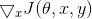
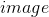
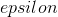
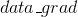
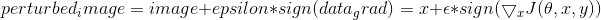

# 生成对抗示例
本教程将提高您对ML（机器学习）模型的安全漏洞的认识，并将深入了解对抗性机器学习的热门话题。您可能会惊讶地发现，
为图像添加难以察觉的扰动会导致模型性能大不相同。鉴于这是一个教程，我们将通过图像分类器上的示例探讨该主题。具体来说，我们将
使用第一种也是最流行的攻击方法之一，即快速梯度符号攻击算法（FGSM）来迷惑 MNIST 分类器。

### 1.威胁模型
对于上下文，有许多类别的对抗性攻击，每种攻击具有不同的目标和对攻击者知识的假设。然而，通常，总体目标是向输入数据添加最少
量的扰动以引起期望的错误分类。对攻击者的知识有几种假设，其中两种是：白盒子和黑盒子。白盒攻击假定攻击者具有对模型的全部
知识和访问权限，包括体系结构、输入、输出和权重。黑盒攻击假设攻击者只能访问模型的输入和输出，并且对底层架构或权重一无所知。
还有几种类型的目标，包括错误分类和源/目标错误分类。错误分类的目标意味着攻击者只希望输出分类错误，但不关心新分类是什么。
源/目标错误分类意味着攻击者想要更改最初属于特定源类的图像，以便将其归类为特定目标类。

FGSM 攻击是一种白盒攻击，其目标是错误分类。有了这些背景信息，我们现在可以详细讨论攻击。

### 2.FGSM（Fast Gradient Sign Attack）
快速梯度标志攻击（FGSM），是迄今为止最早和最受欢迎的对抗性攻击之一，它由 Goodfellow 等人在[Explaining and Harnessing Adversarial Examples]
(https://arxiv.org/abs/1412.6572)中提出，是一种简单但是有效的对抗样本生成算法。它旨在通过利用模型学习的方式和渐变来攻击神经
网络。这个想法很简单，攻击调整输入数据以基于相同的反向传播梯度来最大化损失，而不是通过基于反向传播的梯度调整权重来最小化损失。
换句话说，攻击是利用损失函数的梯度，然后调整输入数据以最大化损失。

在进入代码之前，先讲一下著名的 FGSM 熊猫示例并提取一些符号。


从图中可以看出，是正确分类为“熊猫”的原始输入图像，是的基本事实标签，
代表模型参数，.gif)是用于训练网络的损失。攻击是反向将梯度传播回输入数据以计算。
然后，它在一个方向上（即.gif)）调整输入数据（图中的或0.007），这将使损失最大化。然后，
当目标网络仍然明显是“熊猫”时，由此产生的扰动图像被错误地分类为“长臂猿”。

### 3.实现
在本节中，我们将讨论教程的输入参数，定义被攻击的模型，然后编写攻击代码并运行一些测试。
#### 3.1 引入相关包
```buildoutcfg
from __future__ import print_function
import torch
import torch.nn as nn
import torch.nn.functional as F
import torch.optim as optim
from torchvision import datasets, transforms
import numpy as np
import matplotlib.pyplot as plt
```
#### 3.2 输入
本教程只有三个输入，定义如下：
* epsilons：用于运行的epsilon值列表。在列表中保留0非常重要，因为它表示原始测试集上的模型性能。而且，我们期望epsilon越大，扰
动就越明显，但就降低模型精度方面而言攻击越有效。由于此处的数据范围为[0,1]，因此epsilon值不应超过1。
* pretrained_model：[pytorch/examples/mnist](https://github.com/pytorch/examples/tree/master/mnist)训练的预训练 MNIST 
模型的路径。为简单起见，请在[此处](https://drive.google.com/drive/folders/1fn83DF14tWmit0RTKWRhPq5uVXt73e0h?usp=sharing)
下载预训练模型。
* use_cuda：如果需要和可使用CUDA的布尔标志。注意，带有CUDA的GPU对本教程并不重要，因为本教程使用CPU不会花费太多时间。
```buildoutcfg
epsilons = [0, .05, .1, .15, .2, .25, .3]
pretrained_model = "data/lenet_mnist_model.pth"
use_cuda=True
```

#### 3.2 被攻击的模型
如上所述，受攻击的模型与[pytorch/examples/mnist](https://github.com/pytorch/examples/tree/master/mnist)中的 MNIST 模型
相同。您可以训练并保存自己的 MNIST 模型，也可以下载并使用提供的模型。此处的 Net 定义和测试数据加载器已从 MNIST 示例中复制。
本小节的目的是定义模型和数据加载器，然后初始化模型并加载预训练的权重。
```buildoutcfg
# 定义LeNet模型
class Net(nn.Module):
    def __init__(self):
        super(Net, self).__init__()
        self.conv1 = nn.Conv2d(1, 10, kernel_size=5)
        self.conv2 = nn.Conv2d(10, 20, kernel_size=5)
        self.conv2_drop = nn.Dropout2d()
        self.fc1 = nn.Linear(320, 50)
        self.fc2 = nn.Linear(50, 10)

    def forward(self, x):
        x = F.relu(F.max_pool2d(self.conv1(x), 2))
        x = F.relu(F.max_pool2d(self.conv2_drop(self.conv2(x)), 2))
        x = x.view(-1, 320)
        x = F.relu(self.fc1(x))
        x = F.dropout(x, training=self.training)
        x = self.fc2(x)
        return F.log_softmax(x, dim=1)

#声明 MNIST 测试数据集何数据加载
test_loader = torch.utils.data.DataLoader(
    datasets.MNIST('../data', train=False, download=True, transform=transforms.Compose([
            transforms.ToTensor(),
            ])),
        batch_size=1, shuffle=True)

# 定义我们正在使用的设备
print("CUDA Available: ",torch.cuda.is_available())
device = torch.device("cuda" if (use_cuda and torch.cuda.is_available()) else "cpu")

# 初始化网络
model = Net().to(device)

# 加载已经预训练的模型
model.load_state_dict(torch.load(pretrained_model, map_location='cpu'))

# 在评估模式下设置模型。在这种情况下，这适用于Dropout图层
model.eval()
```

* 输出结果：
```buildoutcfg
Downloading http://yann.lecun.com/exdb/mnist/train-images-idx3-ubyte.gz to ../data/MNIST/raw/train-images-idx3-ubyte.gz
Extracting ../data/MNIST/raw/train-images-idx3-ubyte.gz
Downloading http://yann.lecun.com/exdb/mnist/train-labels-idx1-ubyte.gz to ../data/MNIST/raw/train-labels-idx1-ubyte.gz
Extracting ../data/MNIST/raw/train-labels-idx1-ubyte.gz
Downloading http://yann.lecun.com/exdb/mnist/t10k-images-idx3-ubyte.gz to ../data/MNIST/raw/t10k-images-idx3-ubyte.gz
Extracting ../data/MNIST/raw/t10k-images-idx3-ubyte.gz
Downloading http://yann.lecun.com/exdb/mnist/t10k-labels-idx1-ubyte.gz to ../data/MNIST/raw/t10k-labels-idx1-ubyte.gz
Extracting ../data/MNIST/raw/t10k-labels-idx1-ubyte.gz
Processing...
Done!
CUDA Available:  True
```

#### 3.3 FGSM算法攻击
现在，我们可以通过扰乱原始输入来定义创建对抗性示例的函数。`fgsm_attack`函数有三个输入，是原始的勿扰乱
图像.gif)，是像素方式的扰动量.gif)，是
输入图像的损失梯度。然后该功能将扰动图像创建为:



最后，为了保持数据的原始范围，将扰动的图像剪切到范围[0,1]。
```buildoutcfg
# FGSM算法攻击代码
def fgsm_attack(image, epsilon, data_grad):
    # 收集数据梯度的元素符号
    sign_data_grad = data_grad.sign()
    # 通过调整输入图像的每个像素来创建扰动图像
    perturbed_image = image + epsilon*sign_data_grad
    # 添加剪切以维持[0,1]范围
    perturbed_image = torch.clamp(perturbed_image, 0, 1)
    # 返回被扰动的图像
    return perturbed_image
```

#### 3.4 测试函数
最后，本教程的核心结果来自测试功能。每次调用此测试函数都会对 MNIST 测试集执行完整的测试步骤，并报告最终的准确性。但是，请注意，
此函数也需要输入。这是因为`test`函数展示受到强度为的攻击下被攻击模型的准确性。
更具体地说，对于测试集中的每个样本，该函数计算输入数据的损失梯度，用`fgsm_attack（perturbed_data）`
创建扰乱图像，然后检查扰动的例子是否是对抗性的。除了测试模型的准确性之外，该函数还保存并返回一些成功的对抗性示例，以便稍后可视化。
```buildoutcfg
def test( model, device, test_loader, epsilon ):

    # 精度计数器
    correct = 0
    adv_examples = []

    # 循环遍历测试集中的所有示例
    for data, target in test_loader:

        # 把数据和标签发送到设备
        data, target = data.to(device), target.to(device)

        # 设置张量的requires_grad属性，这对于攻击很关键
        data.requires_grad = True

        # 通过模型前向传递数据
        output = model(data)
        init_pred = output.max(1, keepdim=True)[1] # get the index of the max log-probability

        # 如果初始预测是错误的，不打断攻击，继续
        if init_pred.item() != target.item():
            continue

        # 计算损失
        loss = F.nll_loss(output, target)

        # 将所有现有的渐变归零
        model.zero_grad()

        # 计算后向传递模型的梯度
        loss.backward()

        # 收集datagrad
        data_grad = data.grad.data

        # 唤醒FGSM进行攻击
        perturbed_data = fgsm_attack(data, epsilon, data_grad)

        # 重新分类受扰乱的图像
        output = model(perturbed_data)

        # 检查是否成功
        final_pred = output.max(1, keepdim=True)[1] # get the index of the max log-probability
        if final_pred.item() == target.item():
            correct += 1
            # 保存0 epsilon示例的特例
            if (epsilon == 0) and (len(adv_examples) < 5):
                adv_ex = perturbed_data.squeeze().detach().cpu().numpy()
                adv_examples.append( (init_pred.item(), final_pred.item(), adv_ex) )
        else:
            # 稍后保存一些用于可视化的示例
            if len(adv_examples) < 5:
                adv_ex = perturbed_data.squeeze().detach().cpu().numpy()
                adv_examples.append( (init_pred.item(), final_pred.item(), adv_ex) )

    # 计算这个epsilon的最终准确度
    final_acc = correct/float(len(test_loader))
    print("Epsilon: {}\tTest Accuracy = {} / {} = {}".format(epsilon, correct, len(test_loader), final_acc))

    # 返回准确性和对抗性示例
    return final_acc, adv_examples
```

#### 3.5 运行攻击
实现的最后一部分是实际运行攻击。在这里，我们为 epsilons 输入中的每个 epsilon 值运行一个完整的测试步骤。 对于每个epsilon，我们还
保存最终的准确性，并在接下来的部分中绘制一些成功的对抗性示例。注意随着 epsilon 值的增加，打印精度会如何降低。另外，请注意`ε= 0`
的情况表示原始测试精度，没有攻击。
```buildoutcfg
accuracies = []
examples = []

# 对每个epsilon运行测试
for eps in epsilons:
    acc, ex = test(model, device, test_loader, eps)
    accuracies.append(acc)
    examples.append(ex)
```
* 输出结果：
```buildoutcfg
Epsilon: 0      Test Accuracy = 9810 / 10000 = 0.981
Epsilon: 0.05   Test Accuracy = 9426 / 10000 = 0.9426
Epsilon: 0.1    Test Accuracy = 8510 / 10000 = 0.851
Epsilon: 0.15   Test Accuracy = 6826 / 10000 = 0.6826
Epsilon: 0.2    Test Accuracy = 4301 / 10000 = 0.4301
Epsilon: 0.25   Test Accuracy = 2082 / 10000 = 0.2082
Epsilon: 0.3    Test Accuracy = 869 / 10000 = 0.0869
```

### 4.结果
#### 4.1 准确度 vs Epsilon
第一个结果是精度与 epsilon 图。如前所述，随着 epsilon 的增加，我们期望测试精度降低。这是因为较大的 epsilons 意味着我们朝着最
大化损失的方向迈出更大的一步。请注意，即使 epsilon 值线性分布，曲线中的趋势也不是线性的。例如，ε= 0.05 时的精度仅比 ε= 0 低
约 4％，但ε= 0.2 时的精度比 ε= 0.15 低 25％。另外，请注意在 ε= 0.25 和 ε= 0.3 之间模型的准确性达到10级分类器的随机精度。
```buildoutcfg
plt.figure(figsize=(5,5))
plt.plot(epsilons, accuracies, "*-")
plt.yticks(np.arange(0, 1.1, step=0.1))
plt.xticks(np.arange(0, .35, step=0.05))
plt.title("Accuracy vs Epsilon")
plt.xlabel("Epsilon")
plt.ylabel("Accuracy")
plt.show()
```


#### 4.2 样本对抗性示例
正如天底下没有免费午餐。在这种情况下，随着 epsilon 增加，测试精度降低，但同时扰动也在变得更容易察觉。实际上，在攻击者必须考虑权衡
准确度降级和可感知性。在这里，我们展示了每个 epsilon 值的成功对抗性示例的一些例子。图的每一行显示不同的 epsilon 值。第一行是
ε= 0 的例子，它们代表没有扰动的原始“干净”图像。每个图像的标题显示“原始分类 - >对抗性分类。”注意，扰动在 ε= 0.15 时开始
变得明显，并且在 ε= 0.3 时非常明显。然而，在所有情况下，尽管增加了噪音，人类仍然能够识别正确的类别。
```buildoutcfg
# 在每个epsilon上绘制几个对抗样本的例子
cnt = 0
plt.figure(figsize=(8,10))
for i in range(len(epsilons)):
    for j in range(len(examples[i])):
        cnt += 1
        plt.subplot(len(epsilons),len(examples[0]),cnt)
        plt.xticks([], [])
        plt.yticks([], [])
        if j == 0:
            plt.ylabel("Eps: {}".format(epsilons[i]), fontsize=14)
        orig,adv,ex = examples[i][j]
        plt.title("{} -> {}".format(orig, adv))
        plt.imshow(ex, cmap="gray")
plt.tight_layout()
plt.show()
```


### 5.展望
希望通过本教程能够深入了解对抗机器学习。在这里有很多潜在的方向。这次攻击代表了对抗性攻击研究的开始，因为后来有很多关于如何从
对手攻击和防御 ML 模型的想法。事实上，在NIPS 2017上有一场对抗性攻击和防守比赛，文章：[Adversarial Attacks and Defences Competition]
(https://arxiv.org/pdf/1804.00097.pdf)描述了竞赛中使用的许多方法。防御方面的工作也让我们萌发了使机器学习模型在一般情况下更加
健壮的想法，包括自然扰动和对抗性的输入。

另一个方向是不同领域的对抗性攻击和防御。对抗性研究不仅限于图像领域，对语音到文本模型的攻击可以查看[这里](https://arxiv.org/pdf/1801.01944.pdf)。
但也许了解更多关于对抗性机器学习的最好方法就是动起手来。尝试从 NIPS 2017竞赛中实施不同的攻击，并了解它与 FGSM 的区别。然后，
尝试从您自己的攻击中保护模型。
